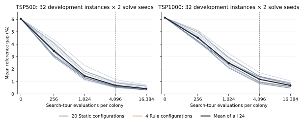

# 实验进展总览：做了什么、参数怎么设、现在有什么结果

更新到 **2026年9月9日，新西兰时间12:35**。本文件面向直接了解研究进展的读者；不需要先读程序、日志或其他reports。计数来自保存的实验状态，质量数字来自已经完成的开发校准或验证结果。

## 1. 现在最值得知道的结论

**求解器和GP训练通路已经跑通，正式训练已推进了一部分；目前还不能说GP优于基线，也不能说四个研究假设已得到验证。**

已经有两类可以直接阅读的质量结果：第一，随着ACO评价次数增加，开发实例上的路线质量持续改善；第二，E3的四组固定策略已经完成全部调参与验证，选出了各组参数。详细数字见第5节和第8节。

| 工作 | 已实际完成 | 还缺什么 |
|---|---|---|
| 数据与求解底座 | 500/1K数据划分；CPU/CUDA FACO；GP动作控制；完整训练、验证和恢复通路 | 后续按需要维护，不把重复工程检查当作新实验 |
| ACO次数校准 | 全部480次批量评价，得到5档预算的质量曲线 | 已完成，不需要重跑 |
| 主Static/Rule基线调参 | 搜索阶段3,467 / 6,208次批量评价，约55.8% | 剩余搜索、80次候选验证、确定最终基线 |
| E1：反馈是否有用 | 10个正式训练均已启动；合计39,635 / 128,000次训练批量评价，约31.0% | 训练结束、候选程序验证、正式测试、状态分叉实验 |
| E2：局部扰动与重启是否协同 | 四格接口、两种小规模重训和逐批行为记录已跑通 | 两格共10个正式训练尚未启动；还需四格测试和交互分析 |
| E3：候选图是否还需要出口 | 四组Static全部调参结束；20个GP训练均已启动，39,479 / 256,000次训练批量评价，约15.4% | GP训练与验证结束、正式测试和效应分析 |
| E4：规则能否迁移 | 原始TSPLIB数据已找到并下载；距离解析正在适配 | 100/10K实例级整理、原始距离GPU接入、冻结程序迁移测试 |
| 外部算法对照 | 已检查本地参考实现，并用部分原生代码核对FACO操作和候选生成 | FACO/APT、MMAS、LKH、DyNACO等完整对照尚未完成 |

表中训练百分比只计算训练阶段，**不包含训练结束后所需的验证和测试**。截至这个时点，E1和E3均没有一个正式GP训练完成全程及最终验证。

**当前运行状态：全部训练和等待入口已暂停。** 先按要求停用了17个绑定其他GPU型号的任务，随后把其余14个运行/等待入口停在保存边界，用于取消运行管理中的反复完整性校验。已完成的评价继续保留。后续只在空闲RTX A5000上接续；完整性校验移除尚未全部完成，因此现在没有重新启动旧入口。进化和ACO的evaluation预算不变，也没有新增算法时间上限。

## 2. 我们究竟在训练什么

目标是解TSP：给定城市坐标，找一条经过每个城市一次、最后回到起点的短路线。

基础求解器是FACO与局部搜索的组合。它从已有路线出发，修改一部分结构，再用checklist 2-opt修复和改进。GP不直接输出整条路线，而是学习一棵小的计算树，给下面三项组成的动作打分：

| 动作分量 | 可选值 | 实际含义 |
|---|---|---|
| 是否重启 | 保持 / 重启 | 是否换到档案中的另一条合法参考路线，并重置信息素 |
| 起始区域 | 4组，每组最多16个节点 | 决定从哪里开始扰动；后续修改不被限制在这个区域里 |
| 扰动程度MNE | 2、4、8、16 | 使用FACO的新增边计数停止阈值；不等于改动节点数，也不等于最终保留下来的新边数 |

因此每次最多比较32个动作。没有合适替代参考路线时，重启动作会被屏蔽。

一次典型训练评价是：取一棵GP树，在固定的实例和随机种子上运行完整ACO，得到路线，再由外部评分器计算平均误差，用这个误差评价GP树。最优标签只供外部评分器使用，GPU求解器看不到标签。

### 报告中的几个计数单位

| 名称 | 本项目中的含义 |
|---|---|
| 1 FE / 1次tour evaluation | 一只蚂蚁完成构造和局部搜索，输出一条完整路线 |
| 1个ACO批次 | 一个colony的32只蚂蚁各完成一次评价，共32 FE |
| 1个colony | 一个实例、一个求解随机种子的独立ACO运行 |
| 1次批量评价 / 原生调用 | 同时评价32个colony；通常是16个实例×2个求解种子 |
| 1次GP个体fitness评价 | 同一棵树分别在500和1K面板上运行，各一次批量评价，共两次 |
| 1代GP | 128个个体全部评价一次，包括精英和重复出现的树 |

主预算为每个colony **4,096 FE**，即128个ACO批次。一次32-colony批量评价合计 **131,072 FE**。这些FE不是LS内部的候选移动检查；后者另计工作量。

质量指标统一写成百分比：

**reference gap = 100 ×（返回路线长度 / 参考标签路线长度 − 1）**。

例如参考长度100、返回长度101，gap就是1%；越低越好。报告采用500和1K等权的平均值。现有合成数据标签按提供的参考解使用，本项目没有重新证明每条标签的全局最优性；正式比较中更好的合法路线可以出现负gap。

## 3. 数据用了哪些，怎么分开的

500和1K是当前训练的主规模。16个主池文件共128,416条记录已完成坐标、排列、闭环和路线成本检查，并建立了固定划分。

| 规模 | 开发集 | 训练集 | 验证集 | 测试集 |
|---|---:|---:|---:|---:|
| TSP500 | 128 | 63,744 | 256 | 128 |
| TSP1K | 128 | 63,648 | 256 | 128 |

开发集用于实现检查、预算校准和基线调参；训练集用于进化；验证集用于选择最终GP程序；测试集用于最后比较。训练时每代抽取16个500实例和16个1K实例，并非每代遍历全部训练集。每代面板固定，所有个体在同一面板上重新评价。面板随机种子是73001。

每个规模的128个开发实例又分为三部分：64个用于基线搜索、32个用于基线候选验证、32个用于FE校准。这三部分不重叠。基线验证用的是开发池内的32个实例，**与GP最终选择使用的256个验证实例不同**。

目前没有运行正式测试集上的方法性能比较。此前读取测试数据用于格式与标签检查，不代表已取得测试性能。

还存在一个数据限制：没有找到足够的父实例元数据，无法完整识别旋转、缩放或子采样形成的同源实例。这项限制保留在研究说明中，不把简单的同坐标去重说成已解决全部数据亲缘关系。

E4可用的其他数据如下。这些是现有文件中的数量，不表示已经全部作为迁移测试样本使用。

| 数据 | 文件中已有记录 | 当前使用状态 |
|---|---|---|
| TSP100 | 训练来源1,280,000条；验证1,280条；测试1,280条，另有一份测试副本 | 尚需实例级整理和固定迁移样本选择；副本不能重复计入 |
| TSP10K | 训练来源6,400条；验证16条；测试16条 | 尚未完成正式迁移面板与全量距离检查 |
| TSPLIB | 本地49个实例，51至1,002个节点 | 已取得同名官方原始实例；全部属于EUC_2D整数距离 |

## 4. 参数怎么设置，依据是什么

**目前这批参数并非全部通过调参选出。** ACO的一部分数值与作者源码默认值一致；GP的128个体、50代等来自v4方案的建议初值；4,096 FE先预设，再经过开发集校准后保留。“已经固定”表示所有相关方法按相同规则执行，不表示已经证明参数最优。

### ACO及局部搜索

以下是当前E1、主基线和E3共享的基础参数。E3额外改变候选图和图外出口规则。

| 参数 | 设置 | 含义与选择依据 |
|---|---:|---|
| 每colony蚂蚁数 | 32 | 首版GPU底座采用并沿用的固定设置；未做32/64/128只蚂蚁的质量调参 |
| 同时评价的colony数 | 32 | 由16实例×2种子组成的批量形状；这是32个独立ACO运行 |
| 主候选宽度 | 16 | 构造时优先考虑的候选；数值与原生默认值一致 |
| 备用候选宽度 | 64 | 主候选不可用时的备用范围；数值与原生默认值一致 |
| LS候选宽度 | 20 | checklist 2-opt的候选范围；数值与原生默认值一致 |
| 距离启发式指数β | 1.0 | 距离启发项的强度；数值与原生默认值一致 |
| 信息素保留比例 | 0.5 | 每次更新保留的比例；数值与原生rho默认值一致 |
| 信息素边界参数p_best | 0.1 | 用于计算信息素上下界；数值与原生默认值一致 |
| 使用epoch-best作为强化来源的概率 | 0.01 | 沿用原生概率数值；将来源中的历史global-best换为epoch-best是本项目的重启适配 |
| 每次LS移动检查上限 | 100,000 | 本项目新增的统一工作量限制；不是原生默认值，也未做性能调参 |
| 初始解LS移动检查上限 | 100,000 | 同样是工程预设，初始准备工作另记 |
| 路线档案容量 | 4 | 控制层预设，用于保存最好路线和结构替代解；未比较不同容量 |
| 档案质量带 | 2% | 控制层预设，限制替代解相对最好路线的质量；未调优该阈值 |
| 起始区域 | 4组×最多16节点 | 预先定义的控制空间：两个连续片段、一个候选邻域、一个分散节点集合 |
| 主FE / 补充FE | 4,096 / 1,024、16,384 | 预设后经完整开发集次数校准保留；不是由耗时或收敛检测决定 |

原生数值来自本地作者源码[progargs.h](../../../../../references/ACO-TSP-Adaptive-Tuning/src/progargs.h)。原生`mfaco`在未指定蚂蚁数时，用`64 × round(4 × sqrt(n) / 64)`计算：500节点得到64只，1,000节点得到128只，见[faco.cpp](../../../../../references/ACO-TSP-Adaptive-Tuning/src/faco.cpp)。因此不能把我们的32只蚂蚁解释为“完整照搬FACO默认配置”，也没有证据称它是最佳GPU形状。32个动作由重启×区域×MNE组成，与32只蚂蚁是两个独立设计量。

**源码默认值与论文实验设置还有差异。** 2022年原始FACO论文§5.6使用的是`64 × ceil(4 × sqrt(n) / 64)`，即向上取整；套用到500和1,000节点时都是128只。前述64/128是当前所查源码的默认计算结果，不能作为该论文的实验参数。论文的FE换算及其他版本见下面的文献对照。

在4,096 FE下，32只蚂蚁对应128个ACO批次；若改为64或128只，分别只有64或32个批次。蚂蚁数会同时改变信息素更新和GP决策的频率，因此即使总FE相同，也不能认为算法效果必然不变。原生LS另有最多接受n次移动的限制，本项目保留该限制并增加100,000次移动检查上限，详见[FACO适配说明](../planning/03_faco_semantics_and_baselines.md)。

主实验采用缓存准备模式：候选和初始准备可复用，准备耗时另记，不把准备时间折算成tour FE。FE为0的校准点仍有共同初始准备，不代表什么计算都没做。

### 与FACO论文的实验设置对照

2026-09-09按用户要求补充核查。改进FACO时，应从所继承版本的论文实验设置出发，明确记录每项偏离；只有“同一组GP和Static共享参数”，还不足以证明与原始FACO的比较充分。下表中的2022和2024设置已读取论文正文，2023的全文缺口单独保留。

| 项目 | 2022原始FACO | 2024自适应FACO | 当前项目已执行配置 |
|---|---|---|---|
| 论文中的相关实验范围 | §5.6，TSPLIB 318至18,512节点 | §5，11,849至104,815节点 | 训练500和1,000节点 |
| 每colony蚂蚁数 | `64 × ceil(4 × sqrt(n) / 64)` | 固定256 | 固定32 |
| 主搜索长度 | 5,000次ACO迭代 | 10,000次ACO迭代 | 4,096 FE，即128次ACO批次 |
| 对应tour FE | 蚂蚁数×5,000；上述公式用于500/1K时均为640,000 FE | 2,560,000 FE | 4,096 FE |
| 信息素保留比例 | 0.5 | 0.5 | 0.5 |
| 主候选 / 备用宽度 | 16 / 64 | 16 / 64 | 16 / 64 |
| 距离启发式β | 表1列1 | 实验段未另列该数值，作者源码默认1 | 1 |
| MNE | 主性能比较固定8 | 自适应集合4、5、6、7、8；固定4和8作参照 | GP或控制策略从2、4、8、16选择 |
| 重复次数 | 与具体实验表对应，不能与GP进化seed混为一个单位 | 每实例/参数组合30次求解 | 每代每实例2次求解；5个进化重复；测试每实例10次求解 |

2022列来自[原始FACO论文](https://arxiv.org/html/2203.02228)的表1与§5.6；它另有超大实例实验采用512只蚂蚁、10,000次迭代，所以“FACO论文参数”也不能脱离具体实验组。2024列来自[自适应FACO论文](https://doi.org/10.1007/978-3-031-70816-9_4)的§4、§5（本地出版PDF第7—8页，书页47—48）。这些是论文数值和算术换算，不表示其在本项目数据上已经复现。

我们实际借用的节点重定位构造，还需要直接对应[2023年节点重定位FACO论文](https://doi.org/10.1016/j.procs.2023.10.292)。本次已确认出版信息、摘要及2024论文对它的引用，但本地未收录全文，出版社和机构库的全文入口未成功取得正文。因此其蚂蚁数、迭代数和各改进开关的实验组合仍标为**未核实**，不能用2024参数替它填表。

除蚂蚁数之外，还应对齐初始化和LS的实际工作：作者实现用多个初始解及2-opt、3-opt改进，本项目用单个最近邻初解和checklist 2-opt；本项目增加了100,000次LS移动检查上限，并关闭了作者源码默认启用的旧蚂蚁解保留和局部源更新。这些已记录在[FACO语义与适配](../planning/03_faco_semantics_and_baselines.md)，不能把影响都归入GP收益。epoch-best、起始区域、重启和MNE选择则是本项目明确研究的控制扩展，应通过共同底座对照分别解释。

**据此需要调整的实验原则：** 后续基础参数以直接继承的FACO版本为依据，同一对照中的FACO和GP使用相同蚂蚁数、启发式、信息素设置、初始化、LS和FE。当前32只蚂蚁没有足够依据作为最终文献对齐配置；原生FACO、重定位版本及自适应版本的完整外部参照仍需完成。GP训练可以单列自己的内层FE预算，但不能把4,096 FE称为复现了论文5,000或10,000次迭代的搜索长度；正式质量评价也需要覆盖所选FACO参照对应的充分搜索预算，检验收益是否只出现在短搜索中。

**对已有工作的影响：** 当前参数、已保存结果和计数继续按原配置保留。若改动蚂蚁数、初始化或LS，需重新检查新底座的FE曲线，并建立新的训练/基线实验版本；旧fitness、旧候选选择与新配置评价不能拼成同一次一致设置的实验。现有4,096 FE校准只支持旧底座。若后续按2024实验采用256只蚂蚁，当前worker对蚂蚁数的上限128也需要先扩展并验证，不能只改配置数字。此次文献核对未修改求解或训练参数，也未启动新的GPU任务。

### GP进化

| 参数 | 设置 | 作用与选择依据 |
|---|---|---|
| 每个条件的独立训练次数 | 5次 | v4预设，用于观察进化随机性；没有通过统计功效分析证明5次已经充分 |
| 进化种子 | 1103、2207、3313、4409、5519 | 最初开发配置预先登记；没有按结果挑种子 |
| 种群大小 | 128 | v4 §4.8的建议初值；未做种群大小的系统比较 |
| 目标代数（含初始种群） | 50 | 同一建议配置，固定完成6,400次个体fitness评价；未依据收敛或平台期确定 |
| 初始树深度 | 1至3 | 预设浅树，以genHalfAndHalf生成；未调优这个范围 |
| 最大树深 / 最大节点数 | 5 / 63 | 限制程序膨胀和执行成本；根深度为0、最多二元运算时，深度5的满树恰好有63节点，执行栈最多6项 |
| 锦标赛选择大小 | 4 | 有放回抽4个取优；控制选择压力，具体数值是预设 |
| 精英个体数 | 4 | 保留本代最好4棵树，占种群3.125%；数量是预设 |
| 交叉概率 / 变异概率 | 0.8 / 0.2 | 分别控制子树重组和新子树产生；具体概率未做搜索 |
| 变异子树深度 | 0至2 | 预设较小的替换子树，以genFull生成；超限按父代回退 |
| 运算符 | 加、减、乘、最小、最大、绝对值、AQ保护运算 | v4固定的表达空间；目标是表达交互并控制数值范围，未搜索其他运算符组合 |
| 数值约束 | 有界FP32运算；常数含−1、0、1及[−2,2]内随机常数 | 固定数值语义与随机常数范围；不是按最终质量调出的范围 |
| 每代训练实例 | 16个500实例＋16个1K实例 | 预设的训练采样量；兼顾两个规模，未比较不同面板大小 |
| 每个训练实例的求解种子数 | 2 | 每代由独立面板RNG生成，两规模分别抽取；重复数是预设 |
| GP候选验证 | 每规模256实例，求解种子17和29 | 使用已固定验证划分的全部成员；候选在共同面板上比较 |
| 正式测试求解种子 | 17、29、41、53、67、79、97、109、127、149 | 预先登记10次求解重复，实例内平均；不把这些重复当独立实例 |

这里需要区分“参数的用途”和“具体数值的证据”：例如限制树深确实控制表达式大小，但这不证明深度5优于4或6；锦标赛和精英有明确作用，也不证明它们都应该取4。原始[v4方案§4.8](../../../design/GP_ACO_TSP_Research_Proposal_v4.md)直接称128/50这一组为“建议初始配置”；[早期开发配置](../../../../configs/gp_development.json)在尚未训练时就已经写入了这些数值。它们是本项目选定的初始研究设置，不能称为DEAP给出的最优默认值或已完成调参的结果。

交叉与变异按DEAP的varAnd流程执行：除4个直接克隆的精英外，124个后代先成对以0.8概率交叉，再逐个以0.2概率独立变异，同一个后代可以经历两者。全部128个个体都在当代面板重评。这里的50代包含初始种群的评价，随后有49次代际转换，不是初始评价之后再额外运行50代。

同一代所有个体使用相同实例和求解种子；不同代换面板，各实验条件和进化重复共享同一套预登记面板。这样可以减少个体比较中的抽样差异，五个进化seed则分别控制树的初始化、选择和遗传操作。由于代与代的数据不同，不能仅凭训练gap随代数的变化断言已经收敛。

完整GP可见12个特征：已用FE比例、停滞、返回相似终态的频率、LS工作量、候选重启动作、候选MNE档位、参考解相对质量、参考结构差异、区域边长超额、档案分歧、信息素强度、区域分散程度。NoFeedback只删除其中的**停滞、返回频率、LS工作量**三个历史反馈输入，再独立训练；它仍然能看到其他状态和动作特征。

每次完整训练包含128×50=6,400次个体fitness评价，即12,800次批量评价，合计1,677,721,600 FE，另加最终候选验证。候选来自各代冠军与最终一代的不同程序；因此验证数量随不同程序数变化，不只验证最后一棵树。

具体换算是：一棵树在2个规模×16实例×2求解种子上运行，每次独立ACO限额为4,096 FE，所以一次fitness评价为262,144 FE；单次完整进化为6,400×262,144=1,677,721,600 FE，约16.78亿。进化按这6,400次完整评价结束，ACO按4,096 FE结束，均无算法时间上限。

已经跑完的8个体×3代、256 FE小训练，只验证了代际流程、完整评价、验证选择和暂停恢复。它没有验证128×50足够，也没有比较不同GP超参数。截至本报告保存时，正式GP尚无一次跑完全部50代和最终验证，因此目前不能声称50代已经收敛。

按现有完整设计，E1的10次、E3的20次，以及E2另需10次训练，训练阶段合计约671.09亿FE，不含验证和测试。这个规模解释了为什么工程已经跑通，但完整研究仍需要较多计算。

## 5. 已得到的结果一：评价次数越多，开发集质量怎样变化

这项校准已经完整结束：24个预先指定策略×5档FE×2个规模×2个面板，共480次批量评价。每规模使用32个开发实例，每实例两个求解种子。

| 每colony FE | TSP500平均gap | TSP1K平均gap | 两规模等权平均 |
|---:|---:|---:|---:|
| 0 | 6.0391% | 6.1332% | 6.0862% |
| 256 | 3.4668% | 4.5238% | 3.9953% |
| 1,024 | 1.4523% | 2.4949% | 1.9736% |
| 4,096 | 0.6849% | 1.1718% | 0.9283% |
| 16,384 | 0.4183% | 0.6833% | 0.5508% |

**能说明的事情：** 在这个开发面板上增加搜索次数确实继续改善路线；4,096 FE已经有明显改善，16,384 FE仍有进一步收益。按原先的决定规则，保留4,096作为主档，并报告短、长两档。

**4,096的选择过程：** 在[执行前的校准协议](../planning/14_baseline_search_and_fe_calibration.md)中，4,096已被指定为主候选，1,024和16,384分别为其1/4和4倍；0用于观察共同初始化，256保留早期工程参照。完整校准检查失败、预算计数、长短运行关系和搜索改善，没有触发重新制定预算的条件，于是保留原设定。它不是遍历预算后选出的最优点，也不是已经到达收敛平台的证据：从4,096到16,384 FE，宏平均gap仍从0.9283%降至0.5508%。

这些数字是全部24个校准策略的描述性平均，不是最终调优基线，不是GP结果，也不是测试集结果。不能把0.9283%直接当成最终方法必须达到的门槛，更不能由此宣称GP有收益。

## 6. 主Static/Rule基线：怎么调，调到哪里了

Static在一次运行中按固定参数决定区域、MNE和重启；Rule根据预先写好的停滞与冷却规则决定动作。二者都使用和GP相同的FACO底座，避免把不同求解器实现的差异误算成学习的收益。

搜索网格总计 **776组：160组Static＋616组Rule**，逐组完整评价，没有按中途成绩淘汰一部分配置。

这个网格搜索的是控制策略的MNE、区域和重启设置；上节的蚂蚁数、β、信息素保留率、候选宽度和GP种群/代数均保持固定。因此“776组基线调参”不等于“ACO底座参数和GP参数都已调优”。

| 部分 | 参数网格 |
|---|---|
| 共同参数 | 4个区域，MNE为2、4、8、16 |
| Static重启 | 不重启；每4/8/16/32/64批请求重启；每批以0.01/0.05/0.1/0.25概率请求重启 |
| Rule停滞升级 | 每4/16/64批停滞按预定规则升级MNE；覆盖网格中允许的初始/最大档位 |
| Rule重启 | 停滞阈值8/32/64，冷却4/16 |

每组配置在每规模64个开发实例×两个种子上搜索，共8次批量评价。两类各取搜索表现最好的10个候选，在另外每规模32个开发实例上验证，最后分别选择Static和Rule赢家。

目前完成搜索阶段 **3,467 / 6,208次**，最终80次验证尚未执行，所以主基线参数还没有定下来。E2也不能先随意挑一组固定规则作为正式对照。

## 7. E1：反馈是否有用

核心比较包括：GP-Full对Static、GP-Full对Rule、GP-Full对GP-NoFeedback。Full和NoFeedback都独立训练5次，不能简单把同一棵已训练Full程序的输入改成0来代替去反馈重训。

### 正式训练进度

下表“已完成代数”只计整代结束的次数；当前未结束的一代已完成的评价也计入批量评价数。每行训练阶段目标均为50代、12,800次批量评价。

| 条件 / 进化种子 | 已完成整代 / 50 | 已完成批量评价 / 12,800 | 训练调用进度 |
|---|---:|---:|---:|
| GP-Full-1103 | 12 | 3,279 | 25.62% |
| GP-Full-2207 | 12 | 3,079 | 24.05% |
| GP-Full-3313 | 14 | 3,796 | 29.66% |
| GP-Full-4409 | 14 | 3,730 | 29.14% |
| GP-Full-5519 | 14 | 3,619 | 28.27% |
| GP-NoFeedback-1103 | 15 | 3,966 | 30.98% |
| GP-NoFeedback-2207 | 13 | 3,574 | 27.92% |
| GP-NoFeedback-3313 | 15 | 3,976 | 31.06% |
| GP-NoFeedback-4409 | 15 | 4,018 | 31.39% |
| GP-NoFeedback-5519 | 25 | 6,598 | 51.55% |

这些运行的不同训练速度还受到此前GPU型号、外来占用和等待影响，不能由完成代数判断哪个方法搜索质量更好。现在所有进度均已保存，等待取消运行管理校验后的接续。

### 状态分叉机制实验

为了进一步问“同样状态下，轻扰动和重扰动的作用是否不同”，已实现保存完整ACO状态、从同一状态分别施加MNE=2和MNE=16，再按相同规则继续。工程面板做了40次调用、156,160 FE，恢复后的轨迹与相应原始执行一致。

这说明接口可以用于同状态干预；正式使用哪些状态层、多少快照、哪些分叉种子及怎样统计仍需确定并执行。**目前没有反馈因果机制结论，也没有E1正式测试胜负。**

## 8. E3：候选图还需不需要图外出口

E3交叉两个因素，形成四个条件：

| 候选先验 | Hard | Escape |
|---|---|---|
| alpha-nearness | 新增边受固定图限制 | 保留受控的图外探索出口 |
| POPMUSIC | 新增边受固定图限制 | 保留受控的图外探索出口 |

每格都有一个完整调优的Static对照，并独立训练5个GP，因此共20个GP训练。每格内的GP和Static使用同一图和同一搜索规则。

候选准备使用LKH导出，最大候选数80，距离缩放系数1,000,000，准备种子73001。POPMUSIC参数为：sample size=10、solutions=50、trials=1、max neighbors=5。导出后按逐节点有效候选数匹配，主候选上限16、LS上限20、备用容量64，其中16个均匀备用槽；两类图不只比较表面上相同的“最大宽度”。已为2,296个非测试实例准备4,592个成对图。

Escape使用固定的受控机制：构造探索概率1/16，每只蚂蚁图外边状态容量64，并受预登记的替换比例1/4及移动规则约束。它不是任意取消所有候选限制，也不是重新调出的第五种控制器。

### 四组Static已经完成的验证结果

每格160配置完整搜索，再验证10个候选；每格1,320次批量评价，四格共5,280次，全部完成。下列是各格选中策略在**开发验证池**上的gap，单位均为百分比。

| 条件 | MNE | 起始区域 | 重启请求 | TSP500 gap | TSP1K gap | 等权平均gap |
|---|---:|---|---|---:|---:|---:|
| alpha-Hard | 8 | 分散节点组（程序区域ID 3） | 每4批 | 4.8240% | 4.7210% | 4.7725% |
| alpha-Escape | 8 | 分散节点组（程序区域ID 3） | 每批概率0.25 | 4.7871% | 4.8694% | 4.8282% |
| POPMUSIC-Hard | 4 | 分散节点组（程序区域ID 3） | 每4批 | 5.0880% | 5.0422% | 5.0651% |
| POPMUSIC-Escape | 4 | 分散节点组（程序区域ID 3） | 每4批 | 5.0085% | 5.0661% | 5.0373% |

所有重启请求仍要满足存在合法替代参考解的条件。POPMUSIC两格恰好选中相同参数，但两格各自完成了全部调参与验证。

目前描述性地看，Escape在这张表里没有一致优势：alpha的Hard较低，POPMUSIC的Escape略低。**这是选参后的开发验证数字，不能据此判定有无出口的正式效应。** 也不能把这些约4.8%—5.1%的数值和第5节约0.9%的校准平均直接作方法比较：两表的数据子集、候选限制和策略集合均不同。

### 20个GP的进度

| 条件 / 进化种子 | 已完成整代 / 50 | 已完成批量评价 / 12,800 | 训练调用进度 |
|---|---:|---:|---:|
| GP-POPMUSIC-Escape-1103 | 8 | 2,092 | 16.34% |
| GP-POPMUSIC-Escape-2207 | 7 | 1,916 | 14.97% |
| GP-POPMUSIC-Escape-3313 | 4 | 1,139 | 8.90% |
| GP-POPMUSIC-Escape-4409 | 5 | 1,426 | 11.14% |
| GP-POPMUSIC-Escape-5519 | 6 | 1,569 | 12.26% |
| GP-POPMUSIC-Hard-1103 | 14 | 3,719 | 29.05% |
| GP-POPMUSIC-Hard-2207 | 8 | 2,157 | 16.85% |
| GP-POPMUSIC-Hard-3313 | 2 | 591 | 4.62% |
| GP-POPMUSIC-Hard-4409 | 7 | 2,026 | 15.83% |
| GP-POPMUSIC-Hard-5519 | 6 | 1,632 | 12.75% |
| GP-alpha-Escape-1103 | 13 | 3,353 | 26.20% |
| GP-alpha-Escape-2207 | 7 | 1,888 | 14.75% |
| GP-alpha-Escape-3313 | 3 | 774 | 6.05% |
| GP-alpha-Escape-4409 | 8 | 2,049 | 16.01% |
| GP-alpha-Escape-5519 | 9 | 2,528 | 19.75% |
| GP-alpha-Hard-1103 | 11 | 3,033 | 23.70% |
| GP-alpha-Hard-2207 | 4 | 1,178 | 9.20% |
| GP-alpha-Hard-3313 | 7 | 1,804 | 14.09% |
| GP-alpha-Hard-4409 | 8 | 2,221 | 17.35% |
| GP-alpha-Hard-5519 | 9 | 2,384 | 18.62% |

四个Static已完成，但20个GP均未结束最终训练与验证，正式TEST还没做。当前无法回答GP在Hard和Escape中分别有多大收益。

## 9. E2：局部扰动与重启是否产生协同

四格定义如下。M00中的固定规则要来自第6节的完整主基线选择；M11复用E1的5个完整Full程序。

| 变体 | 区域与MNE | 重启 | 所需控制器 |
|---|---|---|---|
| M00 | 固定/人工规则 | 固定/人工规则 | 1个最终主基线 |
| M10 | GP学习 | 采用M00的规则 | 5次新的独立训练 |
| M01 | 采用M00的规则 | GP学习 | 5次新的独立训练 |
| M11 | GP学习 | GP学习 | E1的5个Full程序 |

规则在每个变体自己的真实状态上运行，不复制另一组的动作轨迹。两类单因素训练也各自完整执行128×50，不能只限制已经训练好的联合程序来代替。

目前完成的是接口和工程验证：两种单因素版本各做过8个体×3代的小训练及恢复；因素接口实际开发面板共174次调用、1,425,408 FE。后续又完成逐批行为记录，主要接受面板112次调用、917,504 FE；开启/关闭记录不改变对应轨迹。

正式行为数据将记录：选了什么区域和MNE、是否重启、扰动后和LS后的新边、返回相同结构的情况、LS工作量，以及重启前后各4批的变化。历史开发面板用于检查这些量能否正确记录，不提供“已经发现协同”的证据。

最终质量比较的核心量为：**协同量 = L10 + L01 − L00 − L11**，L为相同实例与预算下的平均gap。在这个损失定义下，正值表示联合控制的收益超过两个单独收益之和；还需区间估计和配对统计判断。不能只因M11排名第一就宣称协同。

正式E2计划比较16个控制器，每规模128测试实例、10个求解种子、三档FE，总计3,840次批量评价、880,803,840 FE。**这部分以及10个单因素完整训练都还没有执行。**

## 10. E4：规则能否用于100、10K和TSPLIB

E4将在中等规模训练结束后固定程序，直接用于不同规模和实例结构，不根据迁移测试成绩重新训练或选择阈值。规模迁移和TSPLIB结构迁移分开报告。

当前工作重点是距离定义。本地TSPLIB文本使用归一化坐标；49个同名官方原始实例使用EUC_2D，即对原始欧氏距离按规定舍入为整数。直接在归一化坐标上算连续距离，会变成另一个目标，不能当作原始TSPLIB的成绩。

已经取得全部49个原始实例，并写出CPU的EUC_2D、CEIL_2D、ATT、GEO及对称显式矩阵解析。30个针对性CPU测试通过，也已编译LKH原始距离函数供对照。但完整逐边比较、节点映射、官方路线核对以及GPU整数距离适配还没完成。例如rd100附带tour缺少DIMENSION声明，被当前严格解析器拒绝，仍需结合原实例维数和完整排列核对，不能直接写成已验证的最优路线。

这些都是迁移数据与接口准备，目前没有E4的GP质量结果。100和10K的样本整理及正式面板也未完成；尤其现有10K测试来源只有16条，最终样本与推断范围需如实说明。

## 11. 工程工作完成了什么，它能证明什么

早期reports之所以很多，是因为把各阶段代码检查、恢复、资源事件分别写成了报告。它们证明的是实现和执行通路，不能逐篇算作一个完成的科学实验。

| 已完成的工程内容 | 得到的具体证据 | 支持到什么程度 |
|---|---|---|
| FACO操作移植 | 与原生C++对照236,004次节点重定位、276,318次区间翻转，以及480组构造/LS | 当前操作语义有对照依据 |
| CUDA构造、LS与信息素 | CPU/GPU操作、路线和计数对照；修复过共享计数竞争 | 支持GPU实现继续用于实验，不等于GPU加速已证实 |
| GP数值与动作控制 | Python/C++/CUDA评分、动作合法性、档案和重启状态对照 | 一棵树能在统一底座里实际控制搜索 |
| 常驻worker与真实进化 | 多实例、两种子面板；小训练的训练/验证与暂停恢复 | 训练通路跑通；正式大训练仍需完成 |
| E1状态分叉 | 完整状态保存和恢复、相同切点继续 | 后续可以开展状态干预实验 |
| E2四格和行为记录 | 四格端点一致、开关记录时轨迹一致 | 后续可以做析因与行为解释 |
| E3候选与出口 | 图槽位匹配、受限移动和有限图外状态，以及四格小训练 | 后续可以做公平的四条件实验 |
| 次数预算 | 4,096等档位精确完成，没有时间截止造成的末批丢弃 | 主要对比现在按evaluation次数执行 |

实现过程中确实发现并修复过错误，包括原生区间翻转方向的移植差异、GPU共享计数竞争、候选有效槽位不匹配、行为缓冲的未初始化padding，以及部分恢复/记录逻辑错误。不能把“最终检查通过”写成“过程中从未出错”。

以前还实现并验证过按秒截止的工程入口。按最新要求，它不再是进化与ACO主实验的预算标准；旧报告中的wall-clock、deadline、末批丢弃等描述属于当时的工程检查。

不同型号GPU上的历史耗时分别保留。目前没有覆盖统一条件、同一任务矩阵和各外部算法的完整速度对照，因此不报告一个统一加速倍数，也不声称已量化取消管理校验后能快多少。

## 12. 最终结果准备怎样比较

每个实例使用相同的求解种子做配对比较，先在实例内部平均求解种子；实例是统计单位，不能把32个colony或上千个ACO批次当作额外独立数据点。GP的5次独立进化都报告，不只拿最好的那一次。

| 实验 | 主比较数 | 区间和检验计划 |
|---|---:|---|
| E1 | 3项：Full对Static、Rule、NoFeedback | 实例bootstrap 10,000次；配对符号置换100,000次；3项Holm校正 |
| E2 | 5项：两个单因素收益、两项联合增益、协同量 | 实例bootstrap 10,000次；配对符号置换100,000次；5项Holm校正 |
| E3 | 10项：各格GP收益、Hard/Escape效应及交互 | 按规模分层bootstrap 10,000次；配对符号置换100,000次；10项Holm校正 |
| E4 | 尚需完成具体迁移面板与统计登记 | 不借用前面某组小工程样本来替代 |

训练、验证和测试失败按预定任务保留，不只平均成功的部分。当前正式运行已记账的求解失败为0；资源占用导致的等待和这次主动暂停，不等同于求解器输出无效解。

## 13. 接下来要做什么

1. 完成运行管理简化：取消文件、版本、检查点、图缓存及任务管理的完整性哈希，接续已有编号与进度；恢复前确认不会重新执行已经完成的评价。新检查点读写和实例/标签读取路径已修改，其余入口尚在处理。
2. 只用空闲A5000接续主基线、E1和E3。原先在其他型号上的进度保留，迁移接续时明确记录新设备；不把过去的不同型号时间混在一起算加速比。
3. 主基线完整结束后确定M00，开始E2两种单因素的10次正式训练。
4. 完成每个GP训练的候选验证，再执行E1/E2/E3的固定测试与统计。当前没有任何正式测试胜负，不能先写结论。
5. 同时完成E1状态分叉的正式采样，以及E4数据、距离和GPU适配，最后执行迁移与外部算法对照。

## 14. 需要核对时去哪里看

日常了解项目，优先看本文件。以下链接供核对参数或具体数字，不要求逐个阅读日志。

- [本次进度数字](../../../../results/v1/experiment_progress_2026-09-09.json)：各运行保存的整代数、批量评价数和FE。
- [E1完整参数](../../../../configs/e1_protocol_v1.json)、[主基线网格](../../../../configs/baseline_tuning_v1.json)。
- [FE校准结果](2026-09-09_fe_calibration.md)：第5节表格的原报告。
- [E3 Static选择结果](../../../../results/v1/e3_static_terminal_results.json)：第8节四个验证成绩及所选参数。
- [E2因素接口](2026-09-09_e2_factorial_engine.md)、[行为记录](2026-09-09_e2_behavior_engine.md)、[E1状态分叉](2026-09-09_e1_state_fork_engine.md)：工程实现范围。
- [当前运行规则](../planning/29_runtime_simplification.md)：A5000、按次数预算和取消完整性校验。

原始实验产物仍保存在项目内artifacts，各专题工作在对应工作树内。历史报告保留当时的状态和错误修复记录；其中的旧GPU授权、哈希要求、运行中状态及时间预算描述均不能覆盖本文件说明的最新安排。
