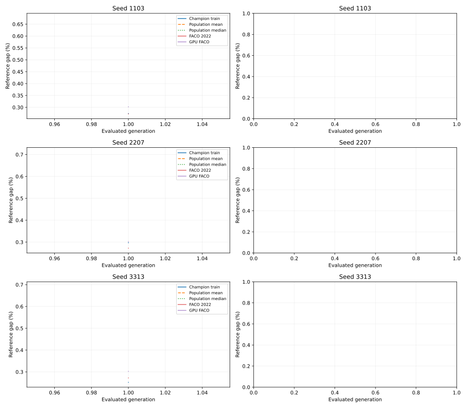

# 三次进化实验：训练、验证、测试与个体解释

更新于 2026-09-09T22:10:10+12:00。当前阶段：**执行 50 代训练与完整候选验证**。

本轮比较 Full GP 与两种 FACO。它是三次进化的实际实验，不代表 NoFeedback、Static/Rule 或 E2–E4 已完成。
完整参数依据、数据划分、评价预算和统计规则见[本轮实验协议](../../experiments/round_three_seed_v2.md)。

## 实验怎样设置

| 项目 | 本轮设置 |
|---|---|
| 进化 seeds | 1103, 2207, 3313 |
| 种群与代数 | 128 个体 × 50 个完整评价代 |
| GP 算子 | 精英4、锦标赛4、交叉0.8、变异0.2、初始深度1–3、变异子树深度0–2、最大深度5、最多63节点 |
| 每代面板 | TSP500、TSP1000 各 16 实例 × 2 求解 seeds |
| 蚂蚁与基础参数 | 两规模均128蚂蚁；beta=1、retention=0.5、候选16/64、LS候选20、p_best=0.1 |
| ACO 迭代 | 训练 H=1000；验证 5000；测试 5000 |
| 数值与资源 | exact；只用空闲 A5000；按评价次数结束，无算法时间上限 |
| 两种对照 | 作者 FACO 2022 的连续距离适配；同 GPU 底座 MNE8、全路线均匀起点、不重启 |

训练 H 按已登记的开发曲线规则选择：保留到5000迭代改进的至少95%，并且两个规模的控制器排名相关都至少0.90；没有短预算通过则用5000。
GP 的种群、选择和树限制是预先登记的设计选择，不宣称已经调参最优。每代的全部个体都重新评价，精英和重复表达式也不复用训练 fitness。

## 当前执行情况

| 任务类别 | 已完成 | 正在运行 | 待运行 | 失败 |
|---|---:|---:|---:|---:|
| 训练前 GPU FACO 对照 | 134 | 0 | 0 | 0 |
| 训练前作者 FACO 对照 | 134 | 0 | 0 | 0 |
| 开发预算标定分片 | 240 | 0 | 0 | 0 |
| GP 进化 | 0 | 3 | 0 | 0 |

活动设备与任务：

- training-1103：cuda07，GPU-0c0f3643-2260-d2fd-f6dd-a2e12c2f89fe
- training-2207：cuda08，GPU-9e271973-f616-3c82-922d-792bb30eefc0
- training-3313：cuda10，GPU-00ccd67e-cb18-e37e-938e-a6339356c950

## 训练与验证曲线

左图是每代训练面板上的冠军、种群平均及中位 gap；面板逐代变化。右图是固定开发监控与完整验证集上的代际冠军曲线，最终验证完成后才填齐50个点。不同预算的两条曲线不能直接当成泛化差距。

| 进化 seed | 已完成代数 | 每代平均用时（秒） | 训练/监控已用 FE |
|---|---:|---:|---:|
| 1103 | 1 | 1422.127 | 1048576000 |
| 2207 | 1 | 1313.493 | 1048576000 |
| 3313 | 1 | 1410.994 | 1048576000 |

## 测试比 FACO 提升多少

先在每个实例内平均10个求解seed，再汇总实例和三次进化。改进百分点 = FACO gap − GP gap，正数表示GP更好；相对路线改善 = 100×(FACO长度−GP长度)/FACO长度。reference gap 使用用户提供的参考解，不另行宣称参考解已被证明最优。

正式测试尚未完整完成，暂不报告提升幅度或显著性结论。

## 进化出的 individual 与真实输入输出

最终个体尚未完成验证选择。

原始路线只在外部评分一次。恢复读取已保存结果；报告不重算路线长度，不计算代码、文件、程序或检查点的完整性哈希。

[机器可读队列状态](../../../artifacts/v2/round-3seed/status.json)；[固定实验配置](../../../artifacts/v2/round-3seed/campaign.json)。

[启动前检查记录](../../../results/v2/campaign_verification.json)包含回归测试、跨 A5000 一致性和小规模完整流程证据。小规模成绩不计入正式结果。
