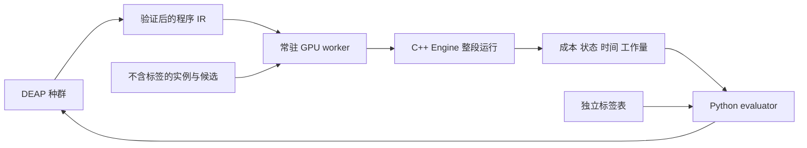

# 求解器架构、事务与 CUDA 计时

## 1. 模块边界

Python：数据索引、DEAP、IR、task manifests、外部 fitness、统计。C++：`Problem/Program/Task/Result`、Engine 生命周期、deadline 和批次调度。CUDA：特征、同树动作评分、FACO 构造、checklist LS、批次归约、信息素和档案维护。pybind11 一次 `evaluate` 完成整段运行；先持有 GIL 验参，再释放 GIL 执行和同步，恢复 GIL 后生成结果。评分诊断接口不作为训练中的逐步 Python 回调。

实例注册只持久化只读信息；每个 program/instance/solve seed 都重新初始化动态状态。第一版同步返回，每 worker 只允许一个活动评价；dtype、shape 和连续性严格检查，拒绝隐式大数组转换。数组或内存所有者必须活到同步返回。

## 2. 数据与线程映射

| 数据/任务 | 布局或映射 | 验证点 |
|---|---|---|
| GP 动作 | 1 warp/colony，lane 对应 0..31 | 同 warp 同程序；非法 lane 仍参加 collective |
| 特征 | `[12][colony][32]` FP32 | 先算全局/两参考/八区域，再广播，不随树重复扫描 |
| 蚂蚁 | 1 block/ant，批次内独立 | tour 修改只能 block 内协作，无共享源异步写入 |
| tour | int32 tour＋position；独立 visited/scratch/checklist | 数组移位避免读写覆盖；move 后 inverse 修复 |
| 候选 | 静态 directed 行＋真实距离排序 LS 视图；合法性图独立 | 无向化不是每节点度数≤2k；不无声截断 |
| 信息素 | O(nk) 稀疏条目＋default 标量/colony | 不分配动态 n² 表，图外值有明确语义 |
| 随机流 | 实例、seed、colony、batch、ant、阶段的独立命名空间 | 拒绝因任务到达顺序改变 RNG 消耗 |

10K、128 ants 时仅 tour＋position 已约 10.24 MB/colony；再加 scratch、visited、pending、档案和候选，必须实测峰值。不能根据 1.28 MB 的 32 候选信息素表推断 GPU 可容纳多少 colony。

## 3. 一次批次与重启事务

批次开始前生成候选参考、区域、合法 mask 和 pre-action 特征→评分→必要时完整重启→冻结源 tour/信息素→并行构造与 LS→收集截止前结果→更新 GB/epoch best/档案→按固定概率选强化 tour→蒸发与强化→刷新缓存与反馈。

重启事务将 active reference 和 epoch best 置为替代解，重算 bounds，重置 stored/default，作废并重建产品缓存，清理 ant、visited、epoch EMA；保留 GB/档案和全局 stagnation。事务中间状态不可进入下一批。没有合法替代 tour 时 mask 全部 restart 动作；只剩一个可行动作或没有 restart 的批次仍要正确处理。

## 4. 数值和编译

GP FP32 与距离/gain 内核分开。第一版 AQ 明确用独立 `rsqrtf(1+y*y)`，不启用全局 fast-math，关闭 GP FMA contraction；CPU/Python oracle 用 FP32 步进并按容差比较。距离用 FP64 连续目标或经核验的整数语义；整数 2-opt gain 不依赖 FP32 score。

先用同一 IR 的 CPU/GPU 评分小程序验证 CUDA 工具链和数组布局，再移植无 GP FACO。CUDA 验收需要 `compute-sanitizer` memcheck/synccheck 和不同合法 mask，不能以 GPU 返回一个数字代替。

## 5. 时间预算

主 GPU 任务同一时刻只评价一个程序，固定同规模实例×seed batch shape。B 是整个固定并发工作负载的 wall-clock 预算，不能折算成单实例独占时延。同型号 GPU、相同 ants、colony 数和预处理规则用于所有共同底座变体。

时间起于实例特定准备、传输和初始可行解建立；预缓存候选必须扣除冻结的对应预处理费用，单列 candidates-given 诊断。另跑真实端到端单实例核验扣费协议。warmup 只消除统一的 context/通用代码加载，不免费做实例专属初始化。

用 host monotonic deadline 与同步完成边界提交 incumbent。搜索开始立即建立廉价可行解；后续结果仅在确认完成时间≤deadline 后替换。越界 kernel 的改进全部丢弃并记录实际超限；短提交批次和 LS 检查粒度由 pilot 校准，必须报告丢弃比例。最后一批全迟到时保留更早 incumbent。禁止通过标签命中提前停止。

## 6. 工程顺序

CPU 原生与操作 oracle→无 GP CUDA 构造/LS→事务和特征→GP 接入→持久 Engine 与绑定→spawn worker→完整 pilot→E1。CUDA Graph、链接式 tour 和专门化 JIT 仅在剖析证实必要时考虑；训练与部署使用相同评分后端。

## 7. 首版CUDA操作实现的边界

2026-09-08，`cuda/faco_operations.cu` 完成显式选点下的并行relocate/flip、原生MNE与checklist LS，并通过CPU差异与memcheck/synccheck/racecheck。一个128线程block负责一只蚂蚁，scratch隔离路线读写，候选gain并行计算后按原生顺序选择，checklist容量以初始至多n节点＋至多4n次重新入队界定。

构造循环条件读取与线程0的计数更新之间必须同步，不能依赖上一轮末尾barrier；其他warp尚可能在读取本轮条件。该竞争曾在输出一致的情况下被racecheck检出，修复与复核见 [CUDA操作报告](../reports/2026-09-08_cuda_operations.md)。后续内核继续保留竞争检查，不能仅检查barrier是否合法。

`cuda_faco_diagnostic` 的显式矩阵、给定选点序列、逐次分配和同步只属于≤1024节点的测试入口。完整Engine仍需独立的坐标/距离视图、设备随机选点与信息素状态、持久缓冲区、时间收费和deadline提交，不允许直接把该入口接到正式训练后称为目标架构已完成。

## 8. 持久固定迭代实现与剩余Engine工作

`FixedFacoGpu` 已持有坐标视图、O(nk)候选/信息素和O(ants*n)工作缓冲；CPU候选准备每次只保留一行临时距离，不构建n²矩阵。它与诊断入口共用 `faco_device.cuh`，通过 `MatrixDistance/CoordinateDistance` 与 `ExplicitChoices/StochasticChoices` 切换输入来源。

每次 `run_iterations` 重建全部动态状态，整个C++循环释放GIL，无Python内层回调；同对象并发调用明确拒绝。当前一个对象只负责一个实例/colony，不能以此替代正式训练的固定多实例×seed并发batch。Philox流按实例/seed/batch/ant/step命名，真实选点已经通过CPU同随机数重放。

该阶段仍使用固定批次数，注册成本与求解成本分开记录；还没有实例缓存收费与同步截止前incumbent提交。下一层必须同时处理廉价初始可行解、准备超预算、跨kernel/下载完成时间、迟到批次丢弃和状态复用，不能只把固定迭代外层条件替换成计时判断。

## 9. 固定多实例deadline层的首版实现

`FacoBatchEngine` 已在固定形状的每个colony上复用构造/LS、信息素与归约内核。通用设备缓冲在构造时分配，实例专属H2D、reset和产品构建位于评价计时内。注册只读坐标和候选，评价前统一建立host廉价incumbent；任何未完成准备或零预算返回都不读取旧设备GB。动态重启事务尚未实现，不能以跨run重置代替。

首版费用按不同实例、廉价/昂贵两阶段确定，在同面板的重复seed间共享一次CPU准备费用。`cached_charged` 的有效时间为实际评价时间加已扣费用；`end_to_end` 从已注册原始坐标重新准备，不复用候选/初始tour且不另收费。费用和实际时间独立返回，不能把逻辑扣费超限当作实际wall超限。两模式已完成开发面板核对，正式费用估计/冻结和独立单实例成本报告仍待G4。

计时从C++ `evaluate` 开始，host坐标/任务输入已就绪；Python封装、磁盘IO与通用shape分配在外部单列。每批kernel同步、下载、CPU完整排列/成本核验后，才为整个面板取共同完成时间。超时批不进入host incumbent，下一次调用在搜索前重置设备状态。该保守边界包括归约/信息素和host验证时间，并不精确到单蚂蚁完成；GPU内核尚无wall-clock中断，CPU初始化LS仅在有限调用前后检查deadline。

32-colony开发计时、16项单实例一致对照、真实更优迟到候选拒绝、三种CUDA工具与输入/状态隔离证据见 [报告](../reports/2026-09-08_batch_engine.md)。提交粒度与丢弃比例仍需在接入完整动作后校准，尚不能视为完整GP Engine验收。

## 10. 主底座在线GP控制

`FacoBatchEngine.evaluate_program` 接收验证后的IR和实验动作mask，一次原生调用完成全部在线批次；不把逐步特征或动作回传Python。每批在旧信息素上计算两个参考模式、四区域、十二特征与合法mask，复用原来的warp GP评分器，执行必要的完整重启，再从真正选中的区域随机抽起点并使用所选MNE进行FACO/LS。

档案、替代参考、反馈和重启的确定性规则见 [控制契约](09_control_contract.md)。持久设备缓冲额外包含4个档案slot及独立复制scratch、每节点真实距离尺度、固定采样、区域、特征和控制状态；仍无n²持久距离矩阵。新局部尺度计入共同CPU准备，历史报告中的准备耗时不能作为新版本冻结费用。

C++专用诊断在动作前、事务后、批次后三个边界下载完整状态，用CPU档案/信息素重放核对；此额外下载计时只用于正确性。Python生产结果仅导出最后一个按时完成批次的档案容量、反馈与重启计数。准备未完成时不返回旧控制状态；迟到批次的档案、EMA和重启计数不进入公开结果。

主底座工程核验及开发计时见 [控制Engine报告](../reports/2026-09-08_control_engine.md)。spawn worker、真实演化评价/checkpoint、终端分项成本剖析、正式预算冻结、E3图条件在完整Engine中的适配仍为后续工作。
