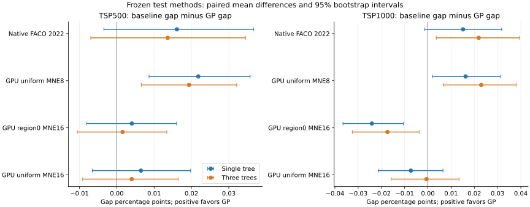
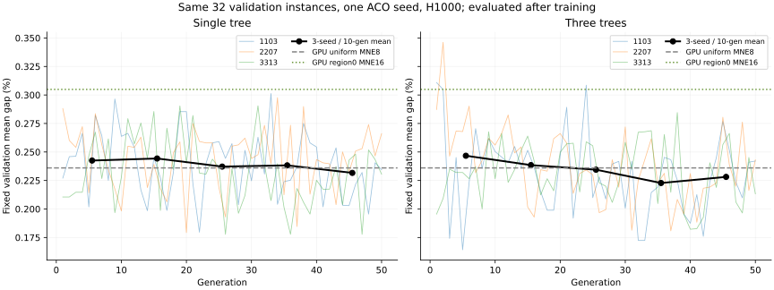

# 六次50代实验：结果说明与算法分析

分析日期：2026-09-10。原始记录：`artifacts/v3/representation-50gen`。

**这轮证明了修复后的GP能够正常进化，也找到了优于GPU MNE=8对照的控制器；但还没有证明它能稳定超过原始FACO和MNE=16强基线，更没有证明三个控制维度都学到了有效的自适应策略。**

目前最有价值的发现是：MNE选择已高度集中到16；区域和重启决策确实受部分反馈影响；50代的验证收益有限且不稳定；迁移到TSP1000时，固定MNE=16、region=0、不重启的基线反而更好。因此，下一步优先做控制行为和训练预算的针对性分析，继续增加代数的优先级较低。

本文件解释结论及其依据。完整参数、六个树的原始表达式和逐项统计见[实验主报告](单树与三树50代实验.md)；执行规则见[本轮协议](../experiments/representation_50gen_v3.md)。

## 1. 这轮到底比较了什么

| 环节 | 设置 | 怎样理解 |
|---|---|---|
| 训练 | 只用TSP500；单树、条件三树各3个GP seed：1103、2207、3313 | 共六次独立进化，结果按3个GP seed汇总 |
| GP | 从头初始化；128个体；完整评价50代 | 4个精英；锦标赛4；交叉80%、变异15%、复制5%；每树最高5，总节点最多63 |
| 每个体fitness | 同代16实例×1个ACO seed×128蚂蚁×1000迭代 | 终局路线平均gap；同代共用面板，代与代的训练面板变化 |
| 训练中监控 | 每5代，冠军在固定16个开发实例×1 seed×1000迭代上运行 | 轻量观察；不是每代大规模验证 |
| 训练后快速验证 | 32个固定验证实例×1 seed×1000迭代 | 评估历史冠军及末代候选，选出每次运行的4名候选 |
| 最终验证 | 每次4名候选，另64个验证实例×3 seeds×5000迭代 | 选定每次运行的一个控制器；六个全部冻结后才进入测试 |
| 正式测试 | TSP500、TSP1000各128实例×10 ACO seeds×128蚂蚁×5000迭代 | 每个冻结控制器、每个规模1280次求解；四类基线使用同一面板 |

蚂蚁数量按照继承的FACO2022规模规则设置，训练适当减少迭代。全部求解按evaluation次数结束，只使用空闲RTX A5000；原生CPU FACO对照使用8线程。六次训练合计78,643,200,000次构造路线评价，另有监控、选模和测试。

完整流程从05:30:45到11:29:33，约5小时59分；2382个任务全部完成，无失败、无重试记录。六次50代都已结束，历史训练状态里的`awaiting_validation`不能覆盖总流程已完成和控制器已冻结的事实。

## 2. 求解质量：超过了哪些基线，哪些还没有

gap定义为路线长度相对参考最优值的超出百分比，越小越好。表中GP是3个GP seed的均值；基线没有GP seed这个维度。

| 方法 | TSP500平均gap% | TSP1000平均gap% |
|---|---:|---:|
| 联合单树 | **0.14759** | 0.25236 |
| 条件三树 | 0.15007 | 0.24563 |
| 原生FACO2022，本轮连续距离实现与路线身份保护 | 0.16369 | 0.26751 |
| GPU FACO，MNE=8，均匀起点，不重启 | 0.16942 | 0.26859 |
| GPU，固定MNE=16，region=0，不重启 | 0.15163 | **0.22825** |
| GPU FACO，MNE=16，均匀起点，不重启 | 0.15406 | 0.24504 |

**TSP500：两种GP显著优于GPU MNE=8；相对原生FACO和两种MNE=16基线，尚无统计上可靠的优势。**

下面的“改善”是基线gap减GP gap，单位为**百分点**，正数表示GP更好。95%区间来自协议中的分层配对bootstrap；主测试9项比较的Wilcoxon p值统一经过Holm校正。

| TSP500比较 | 平均改善（百分点） | 95%区间 | Holm p值 |
|---|---:|---|---:|
| 单树 vs GPU MNE8 | +0.02183 | [0.00863, 0.03572] | 0.000151 |
| 三树 vs GPU MNE8 | +0.01936 | [0.00657, 0.03212] | 0.0000593 |
| 单树 vs 原生FACO | +0.01609 | [-0.00346, 0.03663] | 0.913 |
| 三树 vs 原生FACO | +0.01362 | [-0.00696, 0.03449] | 1.000 |
| 单树 vs 固定MNE16/region0 | +0.00403 | [-0.00804, 0.01602] | 1.000 |
| 三树 vs 固定MNE16/region0 | +0.00156 | [-0.01062, 0.01341] | 1.000 |
| 单树 vs 三树 | +0.00247 | [-0.01077, 0.01649] | 1.000 |

单树和三树相对GPU MNE8分别在84/128、85/128个实例上平均更好。相对固定MNE16/region0，则分别为61/128、68/128；并没有形成稳定的实例优势。

“gap从0.16942%降到0.14759%”不是路线短了约13%。按逐次路线长度计算，单树相对GPU MNE8平均缩短约**0.02165%**；相对固定MNE16/region0仅约**0.00392%**。这轮的绝对改善较小，强基线比较尤其需要看区间，不能只看均值排序。

**TSP1000：固定MNE16/region0更好。** 单树、三树分别落后0.02411、0.01738个百分点；相应改善区间为[-0.03655, -0.01053]、[-0.03252, -0.00377]，均在零的负侧。这里按协议作迁移效果和区间分析，不追加一组主测试显著性结论。三树相对原生FACO的迁移改善区间在零的正侧，但仍落后最强的固定基线。



图中横轴是gap百分点。区间跨过零表示当前证据仍包含两个方向；右图的固定MNE16/region0一行直接显示了迁移劣势。

## 3. 50代有没有持续进步

训练每代换实例和ACO seed，所以不能把训练gap下降全部当成进化收益。这里使用**同一个32实例、1 seed、H1000的验证面板**，对各代训练冠军作比较。这条曲线在训练后补评，不能表述成已经验证过的在线提前停止规则。

| 表示 | g1–10冠军平均验证gap% | g11–20 | g21–30 | g31–40 | g41–50 |
|---|---:|---:|---:|---:|---:|
| 单树，3 seeds均值 | 0.24250 | 0.24428 | 0.23717 | 0.23827 | 0.23166 |
| 三树，3 seeds均值 | 0.24669 | 0.23848 | 0.23446 | 0.22279 | 0.22815 |

单树从首10代到末10代改善0.01083个百分点，三树改善0.01854个百分点。总体有学习迹象，但单代波动明显，三树末10代还弱于g31–40。单树2207、3313从首10代到末10代的均值改善分别只有0.00219、0.00069个百分点。固定开发监控也没有一致、平滑的持续下降。



细线是各GP seed的每代冠军，黑线是3 seeds、每10代的均值。横线是同一快速验证面板上的固定基线。这个小面板中，固定MNE16/region0为0.30488%，GPU MNE8为0.23602%；它们与正式长预算测试的排序不同。**预算、实例面板、ACO seed数量同时变化，现有结果不能把排序变化单独归因于H1000太短。** 但值得在同一开发面板上专门检查短、长预算的候选排名一致性。

5/6次运行的历史冠军最佳快速验证值出现在第10代之后。不过“从50个候选里挑最小值”本来就比从10个里挑更容易，不能用这个事实单独证明50代的收益。

| 运行 | 最终选中个体的生成代 | 快速验证入围排名 | 最终验证gap% |
|---|---:|---:|---:|
| 单树1103 | 22 | 4 | 0.12667 |
| 单树2207 | 37 | 2 | 0.12361 |
| 单树3313 | 36 | 1 | 0.13841 |
| 三树1103 | 32 | 3 | 0.12871 |
| 三树2207 | 37 | 2 | 0.12935 |
| 三树3313 | 50 | 1 | 0.12544 |

**六个最终入选个体都不是第50代训练冠军；只有2/6也是快速验证的第一名。** 例如单树1103，快速验证第一名在最终验证上为0.14551%，快速验证第四名却达到0.12667%，后者才被选中。历史候选保留和最终验证这两步有必要。由于两级验证的面板、seed和预算都不同，这也只是排名不稳定的证据，不能据此认定具体是哪一个因素造成的。

这些曲线属于这轮从头训练的前10代和后40代；旧10代预实验的开发面板及流程不同，其均值不能直接与本轮正式测试相减。

## 4. GP还在退化成浅树吗，fitness有没有区分度

这次没有出现整个种群都退化成深度1的情况。

| 运行 | g50不同IR / 128 | g50不同动作向量 / 128 | 每个体最大树高的中位数 | 总节点中位数 | g50不同fitness值 / 128 |
|---|---:|---:|---:|---:|---:|
| 单树1103 | 128 | 103 | 4 | 14 | 115 |
| 单树2207 | 128 | 115 | 4 | 14.5 | 121 |
| 单树3313 | 128 | 112 | 4 | 17 | 121 |
| 三树1103 | 128 | 105 | 4 | 24.5 | 115 |
| 三树2207 | 128 | 102 | 5 | 31 | 111 |
| 三树3313 | 128 | 100 | 4 | 30 | 104 |

动作向量是在64个冻结训练情境上用同一个CUDA评分器计算的；它说明这些情境上的决策差异，不能保证所有真实轨迹也有同样的多样性。六个末代种群中，任一相同动作向量最多出现2次；末代最优fitness均只有一个个体取得。

因此，初始化、繁殖和行为重复限制起到了作用，fitness也能够区分大多数个体。最终验证选择一个小树并不自动意味着异常：单树3313只有5节点、高度2，可能是简洁规则被选择出来了。

不过，**fitness有区分度不等于训练信号密集**。GP仍然对每个完整个体只得到一个“16次求解后的终局平均gap”。ACO每次迭代都更新在线反馈，但没有把每只蚂蚁或每一步决策的贡献单独奖励给GP；三棵树也共用一个终局fitness。三种控制的信用分配仍然困难。

## 5. 这些树实际学到了什么

### MNE基本变成固定选择16

六个入选控制器，在TSP500和TSP1000的144个真实决策样例中，全部选择MNE=16；再在每个控制器64个冻结训练情境上评分，384个动作也全部选择16。把停滞、回归率、LS工作量分别改成0或1后，MNE选择仍未变化。

144个真实样例来自每个规模2个开发实例、seed17、6个迭代时点，**不是全部测试迭代的动作日志**。384个则是固定情境评分，也不是新增求解。它们是明确的集中选择证据，但不能写成“完整测试100%的迭代都选择16”。

三个MNE角色树尤其容易理解。令`m=mne_level∈{0.25,0.5,0.75,1}`，对应MNE=2/4/8/16；`AQ(a,b)=a/√(1+b²)`。下表解释实数意义下的排序，实际执行仍保留原来的FP32运算和1e-6并列规则。

| 三树运行 | MNE树 | 决策含义 |
|---|---|---|
| 1103 | `AQ(m,m)` | 分数随m单调增加，因此偏好16 |
| 2207 | `AQ(MAX(m,m*progress), MIN(ABS(ls_work),ABS(progress)))` | progress在[0,1]内，分子等于m；分母在四个MNE候选间相同，仍偏好16 |
| 3313 | `m + progress + return_rate` | progress和return_rate给四个候选加同一个数，没有改变MNE排序 |

这说明不能把树中出现`progress`、`ls_work`或`return_rate`，就解释成它在动态调MNE。较浅的MNE树可以表达当前实际学到的规则；强行让它变深不会自动创造新的决策能力。

单树3313的完整树也很简洁：`AQ(m, AQ(return_rate, region_dispersion))`。在非零回归率和实数排序下，它偏好较高MNE和较大区域分散度。回归率接近零时，不同区域分数会变得很接近，1e-6并列规则可能使动作回到编号较小的候选。这是一种带数值阈值的区域偏好，不能直接说成复杂的动态搜索策略。

### 有反馈响应，但还没证明这种响应提高解质量

本次在空闲A5000上调用生产CUDA评分器，逐条复现144个保存动作，全部一致。然后只修改一个反馈输入，其他输入和合法动作保持原样。以下是在每个控制器64个冻结训练情境上，**把指定反馈设为0时改变的动作数**。

| 控制器 | 停滞设0 | 回归率设0 | LS工作量设0 |
|---|---:|---:|---:|
| 单树1103 | 0/64 | 35/64 | 0/64 |
| 单树2207 | 2/64 | 1/64 | 9/64 |
| 单树3313 | 0/64 | 48/64 | 0/64 |
| 三树1103 | 27/64 | 13/64 | 0/64 |
| 三树2207 | 10/64 | 0/64 | 0/64 |
| 三树3313 | 26/64 | 0/64 | 26/64 |

这些变化全部发生在区域或重启选择上。它们证明部分反馈输入在决策上有效；**单步输入干预没有重跑ACO，不能证明保留反馈比去掉反馈的最终路线更好**。把输入设成0或1也可能产生不常见的状态，因此响应数不能作为方法排名。

停滞输入另有一个值得检查的限制：`stagnation=min(连续未改进迭代/32,1)`。32次不改进以后，100次和1000次停滞都显示为1。完整测试各控制器最终停滞数的第10百分位都已超过32，说明结束附近该输入常常饱和；这不能推断整个训练轨迹的饱和比例。后续可以在开发实验中评估是否需要更长尺度的停滞信息。

### 重启频率很高，而且规模改变后行为变化明显

这部分使用全部测试求解的最终累计计数，每格是1280次求解的平均重启次数，不是稀疏动作样例。

| 控制器 | TSP500：5000迭代平均重启次数 | TSP1000：5000迭代平均重启次数 |
|---|---:|---:|
| 单树1103 | 0.0 | 0.0 |
| 单树2207 | 402.8 | 439.6 |
| 单树3313 | 492.8 | 310.3 |
| 三树1103 | 433.8 | 192.8 |
| 三树2207 | 231.4 | 13.7 |
| 三树3313 | 726.4 | 141.9 |

三树3313在TSP500有一次求解重启4798次，接近每次迭代都重启；它也是本轮TSP500平均gap最差的GP seed。代码中的重启会换来源路线、重置相关信息素和回归率/LS工作量滑动平均；GP动作合法性没有额外强制冷却期，只要存在合法档案替代路线即可请求重启。

它的重启分数可读作`ls_work * stagnation² * ref_gap * restart / √2`：非负项乘积大于并列容差时，倾向于重启。它没有明确表示“先积累足够长时间的信息素，再决定重启”。这是检查过度重启的具体线索。

但不能仅凭这张表把迁移失败归因于重启：三树2207迁移后的平均重启只有13.7次，仍落后固定MNE16/region0；单树2207在TSP500重启很多，却是该规模GP中均值最好的一个。需要在同一开发面板上做保留区域规则、禁用或限制重启的配对消融，才能判断因果。

## 6. 时间成本是否值得，三树有没有优势

六次训练中，单树每次约3.83–3.85小时，三树约4.32–4.63小时，这是可并行的单次训练流程墙钟时间。每代等待评价平均为单树3.83–3.93分钟、三树4.47–4.82分钟，后者不包含整代全部管理和监控工作。

按所有GPU分片执行时间求和，单树每次平均用283.72 GPU分钟，三树393.21 GPU分钟，三树多约**38.6%**。监控加选模相对训练GPU时间约为单树11.3%、三树10.7%，验证没有反客为主。

测试中，各方法均按5000迭代结束，但每次路线构造带来的局部搜索工作量不一样。

| 方法 | TSP500累计GPU求解分钟 | 相对GPU MNE8时间 | TSP1000累计GPU求解分钟 | 相对GPU MNE8时间 |
|---|---:|---:|---:|---:|
| 单树，3 seeds均值 | 34.47 | 1.32倍 | 58.03 | 1.51倍 |
| 三树，3 seeds均值 | 33.64 | 1.29倍 | 66.45 | 1.73倍 |
| GPU MNE8 | 26.06 | 1.00倍 | 38.50 | 1.00倍 |
| 固定MNE16/region0 | 41.29 | 1.58倍 | 70.56 | 1.83倍 |
| GPU MNE16均匀 | 39.18 | 1.50倍 | 65.47 | 1.70倍 |

每格对应1280次求解、最多32个实例/seed对一批的累计时间；GP对三次运行取均值。任务分散在不同主机的A5000上，因此它们反映本轮批量吞吐，**不是严格同卡、等墙钟预算的单实例测速**。原生CPU与GPU时间不作直接速度倍数比较。

TSP500中，单树和三树每次路线的LS候选检查数量约为GPU MNE8的1.53倍、1.52倍；TSP1000为1.64倍、1.80倍。因此同样的路线evaluation次数不等于相同的实际工作量，不能把对MNE8的全部质量收益归因于GP反馈。固定MNE16对照正是为了分离这部分影响。

单树、三树在TSP500没有显著质量差别，三树的TSP1000均值略好但也没有稳定超过单树的区间证据。目前看不到三树增加的训练成本带来明确收益。下一轮做小规模开发分析时，可以先用单树降低成本，保留三树作为表示方式对照；这不等于已经证明单树算法更优。

## 7. 下一步优先做什么

优先开展以下开发实验，每项都使用同一面板、配对seed和明确evaluation预算，先用少量候选确定方向。

1. **分离MNE固定取16的贡献。** 固定MNE=16，仅学习区域和重启，继续与固定region0、均匀区域、不重启比较。需要回答：在相同MNE下，GP还带来多少收益？这同时缩小搜索空间。
2. **验证反馈与重启的实际收益。** 对已有控制器在开发集比较原策略、去掉反馈、禁用重启及少量明确的冷却设置。单步评分已经证明“动作会变”，接下来要证明“路线变好”。停滞尺度可以作为后续单独因素，避免同时改变太多内容。
3. **检查短预算选模是否可靠。** 固定同一小批开发实例和ACO seeds，对少量代表树比较H1000与H5000的排名。根据结果再决定是否只对少量候选增加长预算评价；不需要给所有个体恢复5个ACO seeds或扩大每代val。

这批TSP500/TSP1000测试已经揭盲，六个控制器和原统计继续冻结。后续修改属于新的开发轮次，最终确认应使用预先保留、尚未揭盲的测试数据。这轮分析没有改变训练参数、控制器、测试结果，也没有新增ACO评价。

## 8. 证据与复现入口

- [主报告：参数、完整树表达式、原始比较表](单树与三树50代实验.md)
- [精简分析数据](../../results/v3/representation-50gen/analysis.json)：固定验证趋势、候选排名、种群多样性、完整测试累计重启和工作量。
- [生产CUDA评分器的反馈诊断](../../results/v3/representation-50gen/selected_feedback_diagnostic.json)：六个冻结控制器、每个64个训练情境和24个开发回放动作，0/1两种干预；新增ACO评价为0。
- [冻结结果与历史曲线](../../results/v3/representation-50gen/summary.json)、[真实决策输入输出](../../results/v3/representation-50gen/decision_examples.json)。
- [分析脚本](../../scripts/analyze_representation_results.py)：从已有结果重建分析表和两幅图；144个CUDA回放动作与保存动作一致，20个方法/规模组合各1280条结果的均值与正式统计一致。

在项目目录执行：

```sh
TMPDIR=$PWD/.tmp PYTHONPATH=python .venv/bin/python scripts/analyze_representation_results.py
```

只重新绘图可加`--plots-only`，直接使用精简统计。若要重做单步CUDA反馈诊断，先用`/home/linbocheng/bin/gpu-free`选定实时空闲A5000，再在对应主机加`--gpu-uuid <GPU UUID>`运行；该模式只评分、不进行ACO求解。所有代码和输出留在项目内，不生成文件、代码或结果的哈希。
