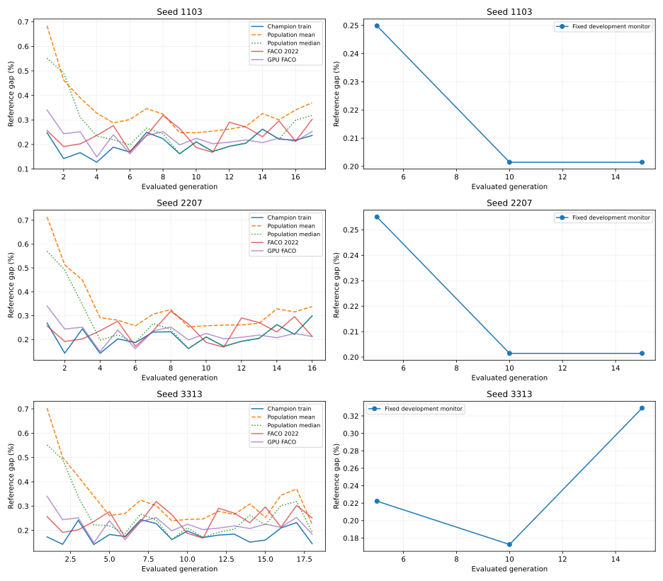

# 三次进化实验：训练、验证、测试与个体解释

更新于 2026-09-10T01:42:25+12:00。当前阶段：**执行训练与候选验证**。

本轮比较 Full GP 与两种 FACO。它是三次进化的实际实验，不代表 NoFeedback、Static/Rule 或 E2–E4 已完成。
完整参数依据、数据划分、评价预算和统计规则见[本轮实验协议](../experiments/round_three_seed_v2.md)。

## 实验怎样设置

| 项目 | 本轮设置 |
|---|---|
| 进化 seeds | 1103, 2207, 3313 |
| 种群与代数 | 128 个体 × 50 个完整评价代 |
| GP 算子 | 精英4、锦标赛4、交叉0.8、变异0.2、初始深度1–3、变异子树深度0–2、最大深度5、最多63节点 |
| 每代面板 | TSP500：16 实例 × 1 个 ACO seed；三个GP seed独立进化 |
| 蚂蚁与基础参数 | 两规模均128蚂蚁；beta=1、retention=0.5、候选16/64、LS候选20、p_best=0.1 |
| ACO 迭代 | 训练 H=1000；验证 5000；测试 5000 |
| 两级验证 | 初筛：32实例 × 1 seed × 1000迭代；前4候选：64实例 × 3 seeds × 5000迭代 |
| 数据用途 | TSP500训练与选模；冻结后TSP500正式测试、TSP1000迁移测试 |
| 数值与资源 | exact；只用空闲 A5000；按评价次数结束，无算法时间上限 |
| 两种对照 | 作者 FACO 2022 的连续距离适配；同 GPU 底座 MNE8、全路线均匀起点、不重启 |

训练 H 按已登记的开发曲线规则选择：保留到5000迭代改进的至少95%，且TSP500控制器排名相关至少0.90。本轮选中1000迭代；TSP1000不参与训练预算或选模。
GP 的种群、选择和树限制是预先登记的设计选择，不宣称已经调参最优。每代的全部个体都重新评价，精英和重复表达式也不复用训练 fitness。

## 当前执行情况

| 任务类别 | 已完成 | 正在运行 | 待运行 | 失败 |
|---|---:|---:|---:|---:|
| 训练前 GPU FACO 对照 | 58 | 0 | 0 | 0 |
| 训练前作者 FACO 对照 | 58 | 0 | 0 | 0 |
| 跨GPU种群分片 | 60 | 3 | 0 | 0 |
| GP 进化 | 0 | 3 | 0 | 0 |

活动设备与任务：

- population-full-seed1103-generation17-individual0-panel0：piccolo，GPU-497aa063-7073-70b9-b0fb-25eca3e9bcd4
- population-full-seed2207-generation16-individual0-panel0：cuda08，GPU-9e271973-f616-3c82-922d-792bb30eefc0
- population-full-seed3313-generation18-individual0-panel0：cuda11，GPU-bc099dd6-2249-14d6-37f9-5da5e055510c
- training-1103：cuda07，CPU进化协调器
- training-2207：cuda07，CPU进化协调器
- training-3313：cuda07，CPU进化协调器

## 训练与验证曲线

左图是每代训练面板上的冠军、种群平均及中位 gap；面板逐代变化。右图是固定开发监控与验证面板上的代际冠军曲线，最终验证完成后才填齐50个点。本轮监控1000迭代，快速验证1000迭代，数据面板不同。
轻量验证曲线使用固定32实例、1 seed和1000迭代；前4候选的最终选模成绩单列。正式配置的两级验证最多为训练FE的9.28%，包含代际监控为9.44%。

| 进化 seed | 已完成代数 | 每代平均用时（秒） | 训练/监控已用 FE |
|---|---:|---:|---:|
| 1103 | 17 | 502.927 | 4462592000 |
| 2207 | 16 | 517.422 | 4200448000 |
| 3313 | 18 | 483.418 | 4724736000 |

开发面板实测：128个体×16实例×1 seed×1000迭代，单张A5000从252.66秒降到137.52秒，约1.84倍加速；完整路线、状态与工作量相同。正式每代时间以上表为准，包含任务等待与训练管理。[测量与分片选择](../../results/v2/tsp500_performance.json)。

## 测试比 FACO 提升多少

先在每个实例内平均10个求解seed，再汇总实例和三次进化。改进百分点 = FACO gap − GP gap，正数表示GP更好；相对路线改善 = 100×(FACO长度−GP长度)/FACO长度。reference gap 使用用户提供的参考解，不另行宣称参考解已被证明最优。

正式测试尚未完整完成，暂不报告提升幅度或显著性结论。

## 进化出的 individual 与真实输入输出

最终个体尚未完成验证选择。

原始路线只在外部评分一次。恢复读取已保存结果；报告不重算路线长度，不计算代码、文件、程序或检查点的完整性哈希。

[机器可读队列状态](../../artifacts/v2/round-tsp500-3seed/status.json)；[固定实验配置](../../artifacts/v2/round-tsp500-3seed/campaign.json)。

[启动前检查记录](../../results/v2/tsp500_verification.json)包含回归测试、跨 A5000 一致性和小规模完整流程证据。小规模成绩不计入正式结果。
