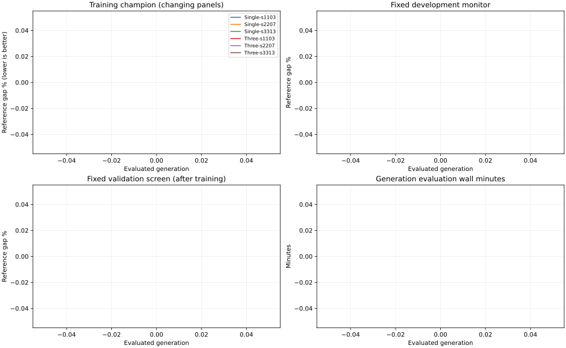

# 单树与三树：六次50代完整实验

更新时间：2026-09-10T11:29:34+12:00。
当前阶段：**complete**；已完成 **300/300个评价代**；正在执行GPU分片：0。

本报告说明实验做了什么、参数如何设置、现在有什么结果。训练只用TSP500；六个程序选定并冻结后才测试TSP500和TSP1000。

- [完整参数和评价流程](../experiments/representation_50gen_v3.md)
- [50代结果分析：质量、曲线、反馈与重启行为](50代结果分析.md)
- [10代预实验结论与加速分析](预实验结论与后续加速.md)

## 实验怎么设置

| 项目 | 本轮设置 |
|---|---|
| 训练规模与重复 | TSP500；单树、条件三树各3个GP seed：1103、2207、3313 |
| GP规模 | 每次128个体，重新初始化，完整评价50代 |
| GP繁殖 | 4个精英；锦标赛大小4；交叉80%、变异15%、复制5% |
| GP结构 | 初始高度2/3/4分层；每树最高5，总计最多63节点；限制行为重复 |
| 个体fitness | 同代16实例×1 ACO seed，最终路线平均gap% |
| ACO预算 | 128蚂蚁×1000迭代；按evaluation次数结束 |
| 训练监控 | 每5代，冠军在固定16个开发实例、1 seed上运行H1000 |
| 训练后选模 | 先32验证实例×1 seed×H1000筛选，再前4名用64实例×3 seeds×H5000 |
| 冻结后测试 | TSP500和TSP1000，各128实例×10 ACO seeds×H5000；比较全部六次进化和四个FACO对照 |

ACO蚂蚁数沿用FACO2022的规模公式；GP参数保留修复后的预实验设置。这轮只调整执行效率，详细依据与共用参数见上方协议。

## 当前进度

| 运行 | 完成代数 | 最近一代评价分钟 | 最近训练冠军gap% | 最终验证gap% |
|---|---:|---:|---:|---:|
| joint_single-s1103 | 50/50 | 3.55 | 0.13217 | 0.12667 |
| joint_single-s2207 | 50/50 | 3.54 | 0.13391 | 0.12361 |
| joint_single-s3313 | 50/50 | 3.54 | 0.13072 | 0.13841 |
| conditional_three-s1103 | 50/50 | 4.54 | 0.10352 | 0.12871 |
| conditional_three-s2207 | 50/50 | 5.53 | 0.11767 | 0.12935 |
| conditional_three-s3313 | 50/50 | 5.02 | 0.13527 | 0.12544 |

最近训练gap来自不同代的不同面板，不能直接横向比较。开发监控和验证使用固定面板。

## 曲线



验证曲线在该次50代训练结束后补齐；训练期间每5代仅观察一次开发集冠军。

## 当前个体与实际决策

树的输出是候选动作的分数，分数最大者被执行。分数本身不是路线长度，也不是改进百分比。

| 输入 | 含义 |
|---|---|
| progress | 已用ACO评价次数占本次预算的比例 |
| stagnation | 连续未改进的迭代数，除以32并截断到1 |
| return_rate | 局部搜索后回到来源路线的比例，使用滑动平均 |
| ls_work | 局部搜索工作量的归一化滑动平均 |
| restart | 当前候选动作是否重启，0或1 |
| mne_level | 候选MNE等级：0.25/0.5/0.75/1对应2/4/8/16 |
| ref_gap | 候选来源路线相对算法内部最好路线的差 |
| ref_diff | 重启候选路线与当前路线的边差异 |
| region_excess | 候选区域路线边相对局部距离尺度的超额长度 |
| archive_disagreement | 候选区域的路线边与档案路线的不一致程度 |
| pheromone_strength | 候选区域路线边的信息素强度 |
| region_dispersion | 候选区域路线边连向区域外部的比例 |

### joint_single-s1103（验证选中）

```text
joint: ADD(MUL(SUB(mne_level, restart), AQ(MAX(AQ(return_rate, region_excess), archive_disagreement), SUB(mne_level, AQ(return_rate, region_excess)))), MIN(AQ(SUB(mne_level, AQ(archive_disagreement, 1.0)), 1.0), pheromone_strength))
  节点=25，高度=5，输入=archive_disagreement, mne_level, pheromone_strength, region_excess, restart, return_rate
```

实际回放：TSP500第1个解释实例，第5000次动作前。选择restart=0、region=1、MNE=16。

所选动作的12个输入值（完整候选输入保存在results）：

```text
progress: 0.9998
stagnation: 1
return_rate: 0.02241523
ls_work: 0.01007358
restart: 0
mne_level: 1
ref_gap: 0.002307781
ref_diff: 0
region_excess: 0
archive_disagreement: 0.15625
pheromone_strength: 0.9072042
region_dispersion: 0.0625
```

32个动作分数：`[0.18224076926708221, 0.3636668026447296, 0.5439240336418152, 0.7231352925300598, 0.13674025237560272, 0.3459261357784271, 0.546964704990387, 0.7407122850418091, 0.18224076926708221, 0.3636668026447296, 0.5439240336418152, 0.7231352925300598, 0.18224072456359863, 0.36366671323776245, 0.5439239740371704, 0.7231351733207703, 0.1603844165802002, 0.34343990683555603, 0.5257987380027771, 0.7071067094802856, 0.1603844165802002, 0.3434399366378784, 0.5257987380027771, 0.7071067094802856, 0.1603844165802002, 0.34343990683555603, 0.5257987380027771, 0.7071067094802856, 0.1603844165802002, 0.34343990683555603, 0.5257987380027771, 0.7071067094802856]`。

### joint_single-s2207（验证选中）

```text
joint: AQ(AQ(mne_level, AQ(mne_level, MIN(MIN(ls_work, region_excess), region_excess))), SUB(stagnation, return_rate))
  节点=13，高度=5，输入=ls_work, mne_level, region_excess, return_rate, stagnation
```

实际回放：TSP500第1个解释实例，第5000次动作前。选择restart=0、region=0、MNE=16。

所选动作的12个输入值（完整候选输入保存在results）：

```text
progress: 0.9998
stagnation: 1
return_rate: 0.01815166
ls_work: 0.008065434
restart: 0
mne_level: 1
ref_gap: 1.110223e-13
ref_diff: 0
region_excess: 0.001416866
archive_disagreement: 0
pheromone_strength: 0.9999999
region_dispersion: 0.0625
```

32个动作分数：`[0.17306207120418549, 0.3191107511520386, 0.4281320869922638, 0.5045585632324219, 0.17306207120418549, 0.3191106617450714, 0.42813193798065186, 0.504558265209198, 0.17306207120418549, 0.3191107213497162, 0.4281320571899414, 0.5045585036277771, 0.17306207120418549, 0.3191106617450714, 0.42813193798065186, 0.504558265209198, 0.17306207120418549, 0.3191106617450714, 0.42813193798065186, 0.504558265209198, 0.17306207120418549, 0.3191106617450714, 0.42813193798065186, 0.504558265209198, 0.17306207120418549, 0.3191106617450714, 0.42813193798065186, 0.504558265209198, 0.17306207120418549, 0.3191106617450714, 0.42813193798065186, 0.504558265209198]`。

### joint_single-s3313（验证选中）

```text
joint: AQ(mne_level, AQ(return_rate, region_dispersion))
  节点=5，高度=2，输入=mne_level, region_dispersion, return_rate
```

实际回放：TSP500第1个解释实例，第5000次动作前。选择restart=0、region=3、MNE=16。

所选动作的12个输入值（完整候选输入保存在results）：

```text
progress: 0.9998
stagnation: 1
return_rate: 0.004188632
ls_work: 0.002595732
restart: 0
mne_level: 1
ref_gap: 0.01842801
ref_diff: 0
region_excess: 0
archive_disagreement: 0.0078125
pheromone_strength: 0.9641395
region_dispersion: 0.9375
```

32个动作分数：`[0.2499977946281433, 0.4999955892562866, 0.7499933838844299, 0.9999911785125732, 0.2499977946281433, 0.4999955892562866, 0.7499933838844299, 0.9999911785125732, 0.24999786913394928, 0.49999573826789856, 0.749993622303009, 0.9999914765357971, 0.24999882280826569, 0.49999764561653137, 0.7499964833259583, 0.9999952912330627, 0.2499977946281433, 0.4999955892562866, 0.7499933838844299, 0.9999911785125732, 0.2499977946281433, 0.4999955892562866, 0.7499933838844299, 0.9999911785125732, 0.24999791383743286, 0.4999958276748657, 0.7499937415122986, 0.9999916553497314, 0.24999888241291046, 0.4999977648258209, 0.7499966621398926, 0.9999955296516418]`。

### conditional_three-s1103（验证选中）

```text
restart: SUB(progress, MAX(SUB(return_rate, ref_gap), SUB(MUL(SUB(return_rate, ref_gap), SUB(stagnation, 0.8487823009490967)), MIN(MIN(restart, -1.570115566253662), restart))))
  节点=19，高度=5，输入=progress, ref_gap, restart, return_rate, stagnation
region: MUL(MUL(MAX(restart, pheromone_strength), ABS(return_rate)), SUB(SUB(archive_disagreement, ABS(region_dispersion)), -0.25930285453796387))
  节点=13，高度=4，输入=archive_disagreement, pheromone_strength, region_dispersion, restart, return_rate
mne: AQ(mne_level, mne_level)
  节点=3，高度=1，输入=mne_level
```

实际回放：TSP500第1个解释实例，第5000次动作前。选择restart=1、region=0、MNE=16。

所选动作的12个输入值（完整候选输入保存在results）：

```text
progress: 0.9998
stagnation: 1
return_rate: 0.008647561
ls_work: 0.005990386
restart: 1
mne_level: 1
ref_gap: 0.0009842855
ref_diff: 0.0234375
region_excess: 0
archive_disagreement: 0
pheromone_strength: 0.9999861
region_dispersion: 0.0625
```

- restart：分数`[-0.5716231465339661, -0.5714743733406067]`，合法`[True, True]`，选择1。
- region：分数`[0.0017018646467477083, 0.0017018646467477083, -0.0003249074216000736, -0.006270105484873056]`，合法`[True, True, True, True]`，选择0。
- mne：分数`[0.24253562092781067, 0.4472135603427887, 0.6000000238418579, 0.7071067094802856]`，合法`[True, True, True, True]`，选择3。

### conditional_three-s2207（验证选中）

```text
restart: AQ(MAX(stagnation, ADD(AQ(0.0, 1.0), stagnation)), MUL(AQ(stagnation, ref_gap), AQ(stagnation, ref_gap)))
  节点=15，高度=4，输入=ref_gap, stagnation
region: archive_disagreement
  节点=1，高度=0，输入=archive_disagreement
mne: AQ(MAX(mne_level, MUL(mne_level, progress)), MIN(ABS(ls_work), ABS(progress)))
  节点=11，高度=3，输入=ls_work, mne_level, progress
```

实际回放：TSP500第1个解释实例，第5000次动作前。选择restart=0、region=1、MNE=16。

所选动作的12个输入值（完整候选输入保存在results）：

```text
progress: 0.9998
stagnation: 1
return_rate: 0.02351771
ls_work: 0.009935116
restart: 0
mne_level: 1
ref_gap: 0.002424021
ref_diff: 0
region_excess: 0.007265431
archive_disagreement: 0.296875
pheromone_strength: 1
region_dispersion: 0.0625
```

- restart：分数`[0.7071089148521423, 0.7071077227592468]`，合法`[True, True]`，选择0。
- region：分数`[0.03125, 0.296875, 0.0, 0.046875]`，合法`[True, True, True, True]`，选择1。
- mne：分数`[0.2499876469373703, 0.4999752938747406, 0.7499629259109497, 0.9999505877494812]`，合法`[True, True, True, True]`，选择3。

### conditional_three-s3313（验证选中）

```text
restart: MUL(MUL(MUL(ls_work, stagnation), MUL(stagnation, ref_gap)), AQ(restart, -1.0))
  节点=11，高度=3，输入=ls_work, ref_gap, restart, stagnation
region: ADD(progress, MAX(progress, MUL(archive_disagreement, pheromone_strength)))
  节点=7，高度=3，输入=archive_disagreement, pheromone_strength, progress
mne: ADD(mne_level, ADD(progress, return_rate))
  节点=5，高度=2，输入=mne_level, progress, return_rate
```

实际回放：TSP500第1个解释实例，第5000次动作前。选择restart=0、region=0、MNE=16。

所选动作的12个输入值（完整候选输入保存在results）：

```text
progress: 0.9998
stagnation: 1
return_rate: 0.006982795
ls_work: 0.003015122
restart: 0
mne_level: 1
ref_gap: 0.001614324
ref_diff: 0
region_excess: 0
archive_disagreement: 0
pheromone_strength: 0.9997741
region_dispersion: 0.0625
```

- restart：分数`[0.0, 0.0]`，合法`[True, True]`，选择0。
- region：分数`[1.9996000528335571, 1.9996000528335571, 1.9996000528335571, 1.9996000528335571]`，合法`[True, True, True, True]`，选择0。
- mne：分数`[1.2567827701568604, 1.5067827701568604, 1.7567827701568604, 2.0067827701568604]`，合法`[True, True, True, True]`，选择3。

单树对32个完整动作打分。三树在同一动作前状态依次决定restart、region、MNE，分别比较2、4、4个条件分数，最后只执行一个动作。

ref_gap是当前来源路线相对算法内部最好路线的差，输入不包含参考最优值。

## 与FACO比较

正的改善百分点表示GP更好；相对路线改善与gap降幅是不同指标。

| 规模 | 方法 | 对照 | GP gap% | 对照gap% | 改善百分点 | 95%区间 |
|---:|---|---|---:|---:|---:|---|
| 500 | joint_single | 原始FACO2022 | 0.14759 | 0.16369 | 0.01609 | [-0.00346, 0.03663] |
| 500 | joint_single | GPU FACO MNE8均匀 | 0.14759 | 0.16942 | 0.02183 | [0.00863, 0.03572] |
| 500 | joint_single | 固定MNE16/region0 | 0.14759 | 0.15163 | 0.00403 | [-0.00804, 0.01602] |
| 500 | joint_single | GPU MNE16均匀 | 0.14759 | 0.15406 | 0.00647 | [-0.00656, 0.01978] |
| 500 | conditional_three | 原始FACO2022 | 0.15007 | 0.16369 | 0.01362 | [-0.00696, 0.03449] |
| 500 | conditional_three | GPU FACO MNE8均匀 | 0.15007 | 0.16942 | 0.01936 | [0.00657, 0.03212] |
| 500 | conditional_three | 固定MNE16/region0 | 0.15007 | 0.15163 | 0.00156 | [-0.01062, 0.01341] |
| 500 | conditional_three | GPU MNE16均匀 | 0.15007 | 0.15406 | 0.00399 | [-0.00912, 0.01643] |
| 500 | joint_single | conditional_three | 0.14759 | 0.15007 | 0.00247 | [-0.01077, 0.01649] |
| 1000 | joint_single | 原始FACO2022 | 0.25236 | 0.26751 | 0.01515 | [-0.00137, 0.03178] |
| 1000 | joint_single | GPU FACO MNE8均匀 | 0.25236 | 0.26859 | 0.01623 | [0.00193, 0.03122] |
| 1000 | joint_single | 固定MNE16/region0 | 0.25236 | 0.22825 | -0.02411 | [-0.03655, -0.01053] |
| 1000 | joint_single | GPU MNE16均匀 | 0.25236 | 0.24504 | -0.00732 | [-0.02139, 0.00651] |
| 1000 | conditional_three | 原始FACO2022 | 0.24563 | 0.26751 | 0.02188 | [0.00361, 0.03936] |
| 1000 | conditional_three | GPU FACO MNE8均匀 | 0.24563 | 0.26859 | 0.02296 | [0.00664, 0.03797] |
| 1000 | conditional_three | 固定MNE16/region0 | 0.24563 | 0.22825 | -0.01738 | [-0.03252, -0.00377] |
| 1000 | conditional_three | GPU MNE16均匀 | 0.24563 | 0.24504 | -0.00060 | [-0.01584, 0.01340] |
| 1000 | joint_single | conditional_three | 0.25236 | 0.24563 | -0.00673 | [-0.02143, 0.00637] |

TSP500主比较的路线长度变化与配对检验（九项共同做Holm校正）：

| 方法 | 对照 | 相对路线改善% | 实例胜/平/负 | Holm p |
|---|---|---:|---|---:|
| joint_single | 原始FACO2022 | 0.01583 | 69/0/59 | 0.9128 |
| joint_single | GPU FACO MNE8均匀 | 0.02165 | 84/0/44 | 0.0001507 |
| joint_single | 固定MNE16/region0 | 0.00392 | 61/0/67 | 1 |
| joint_single | GPU MNE16均匀 | 0.00633 | 76/0/52 | 0.9128 |
| conditional_three | 原始FACO2022 | 0.01337 | 64/0/64 | 1 |
| conditional_three | GPU FACO MNE8均匀 | 0.01919 | 85/0/43 | 5.929e-05 |
| conditional_three | 固定MNE16/region0 | 0.00144 | 68/0/60 | 1 |
| conditional_three | GPU MNE16均匀 | 0.00387 | 71/0/57 | 1 |
| joint_single | conditional_three | 0.00234 | 68/0/60 | 1 |

各方法独立批次的求解时间：GPU每批最多32实例-seed组合，CPU原生逐组合求解。下表摊销秒数反映各自配置的吞吐，不能当作单实例延迟；主机和设备明细保存在统计文件。

| 规模 | 方法 | 本轮计算组合数 | 累计求解秒 | 每组合摊销秒 |
|---:|---|---:|---:|---:|
| 500 | conditional_three-s1103 | 1280 | 2046.34 | 1.5987 |
| 500 | conditional_three-s2207 | 1280 | 2248.69 | 1.7568 |
| 500 | conditional_three-s3313 | 1280 | 1760.60 | 1.3755 |
| 500 | 原始FACO2022 | 1280 | 4750.44 | 3.7113 |
| 500 | GPU MNE16均匀 | 1280 | 2350.65 | 1.8364 |
| 500 | GPU FACO MNE8均匀 | 1280 | 1563.79 | 1.2217 |
| 500 | 固定MNE16/region0 | 1280 | 2477.13 | 1.9353 |
| 500 | joint_single-s1103 | 1280 | 2429.67 | 1.8982 |
| 500 | joint_single-s2207 | 1280 | 1899.64 | 1.4841 |
| 500 | joint_single-s3313 | 1280 | 1874.96 | 1.4648 |
| 1000 | conditional_three-s1103 | 1280 | 3873.97 | 3.0265 |
| 1000 | conditional_three-s2207 | 1280 | 4195.59 | 3.2778 |
| 1000 | conditional_three-s3313 | 1280 | 3892.28 | 3.0408 |
| 1000 | 原始FACO2022 | 1280 | 6397.49 | 4.9980 |
| 1000 | GPU MNE16均匀 | 1280 | 3927.94 | 3.0687 |
| 1000 | GPU FACO MNE8均匀 | 1280 | 2309.87 | 1.8046 |
| 1000 | 固定MNE16/region0 | 1280 | 4233.58 | 3.3075 |
| 1000 | joint_single-s1103 | 1280 | 4208.49 | 3.2879 |
| 1000 | joint_single-s2207 | 1280 | 2901.88 | 2.2671 |
| 1000 | joint_single-s3313 | 1280 | 3335.07 | 2.6055 |

## 资源、预算与恢复

训练、监控和选模分别累计GPU求解时间，多卡并行时这些时间之和大于实际墙钟时间。

| 运行 | 训练GPU分钟 | 监控GPU分钟 | 选模GPU分钟 |
|---|---:|---:|---:|
| joint_single-s1103 | 283.67 | 0.92 | 31.34 |
| joint_single-s2207 | 288.48 | 0.89 | 30.54 |
| joint_single-s3313 | 279.01 | 0.97 | 31.50 |
| conditional_three-s1103 | 370.96 | 1.04 | 39.02 |
| conditional_three-s2207 | 407.89 | 1.07 | 44.35 |
| conditional_three-s3313 | 400.78 | 1.07 | 39.34 |

每代128个体×16实例×1 ACO seed×128蚂蚁×1000迭代，共262,144,000 FE。六次完整训练78,643,200,000 FE；baseline、监控、选模、测试分别记账。
每60秒发现全服务器空闲A5000。一张卡一个worker；同代分片可分卡，收齐后才繁殖。没有算法时间上限；没有文件、数据或检查点哈希。
本轮构建：`build/v3-representation-optimized`；个体分片：`64`。
原始路线、日志、检查点位于artifacts；精简统计和图位于results。已完成分片可以直接恢复。
