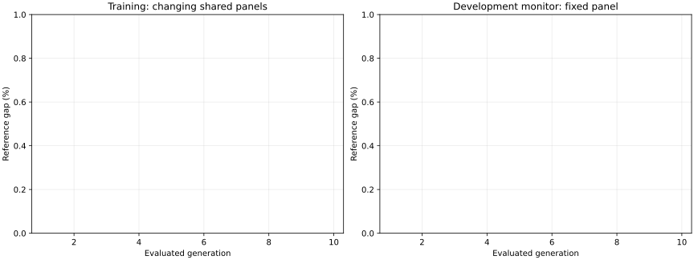

# 单树与三树预实验

更新于 2026-09-10T02:29:49+12:00。当前阶段：`baselines_and_training`。

本轮比较共同修复繁殖后的联合单树和条件三树，各3 seed×10代，只训练TSP500。每代128个体，各跑16实例×1个ACO seed×128蚂蚁×1000迭代。旧50代实验已暂停；本轮结束后不会自动进入50代、正式val或test。

g5/g10在16个固定开发实例上监控；每次只把g10冠军放到32开发实例×3 ACO seeds×H5000上比较。下表gap越小越好；训练面板逐代变化，因此不能把训练曲线的每次下降都解释为进化改进。

| 表示 | GP seed | 已评价代数 | 最近训练gap | 最近开发监控gap | 结束开发gap |
|---|---:|---:|---:|---:|---:|
| joint_single | 1103 | 0/10 | — | — | — |
| joint_single | 2207 | 0/10 | — | — | — |
| joint_single | 3313 | 0/10 | — | — | — |
| conditional_three | 1103 | 0/10 | — | — | — |
| conditional_three | 2207 | 0/10 | — | — | — |
| conditional_three | 3313 | 0/10 | — | — | — |

## 与FACO和固定MNE16比较

原生FACO2022与GPU均匀起点MNE8是主要对照。固定region0 MNE16对应旧冠军`mne_level`；均匀起点MNE16用于分开MNE增大和起始区域限制的影响。结果未齐时不计算部分面板的提升。

| 结束开发对照 | 已返回实例/seed数 | 平均gap |
|---|---:|---:|
| faco_2022_continuous_identity_guard | 96/96 | 0.20047% |
| gpu_faco_mne8_uniform_no_restart | 96/96 | 0.14446% |
| gpu_fixed_mne16_region0_no_restart | 96/96 | 0.14239% |
| gpu_faco_mne16_uniform_no_restart | 96/96 | 0.15469% |

## 繁殖是否真的改变了个体

旧第9→10代的48/49/50次交叉全部未改变结构；根节点不可交叉、单叶父代不参与交叉、同分时优先短树共同放大了复制。当前根节点可选，同分父代随机；采用互斥80%交叉、15%变异、5%复制。同代IR全部不同，相同行为最多2个。以下行为统计来自固定64个训练情境，不是全部ACO轨迹。

| run | 唯一行为/128 | 最大同行为组 | 交叉尝试/改结构/改行为 | 繁殖秒数 |
|---|---:|---:|---|---:|

初始化高度按边数为2/3/4；进化后单叶高度0仍合法。每树高度≤5，整个个体总节点≤63。更深的树不自动意味着更好，需同时观察探索和最终性能。

## 每次进化当前的冠军

单树输出32个完整动作的相对分数。三树按restart→region→MNE输出2/4/4个条件分数，使用同一个动作前状态，最后才执行一次动作。分数不是概率。

## 运行和证据

完整参数、FE账目、特征含义和论文来源见[预实验协议](../experiments/representation_pilot_v3.md)。工程检查、近并列数值差异和测速见`results/v3/representation_cuda.json`；训练与结束开发比较的原始输入输出在`artifacts/v3/gp-representation-pilot/jobs/`。结束开发任务保存真实决策轨迹：单树32分、三树2/4/4分，附12个特征和合法mask。

行为描述使用与训练完全相同的CUDA评分器，不做内容哈希，不缓存替代任何真实ACO评价。参考最优值只用于外部评分，不进入GP输入。3 seed结果用于判断是否值得扩大实验，不能保证统计显著。
