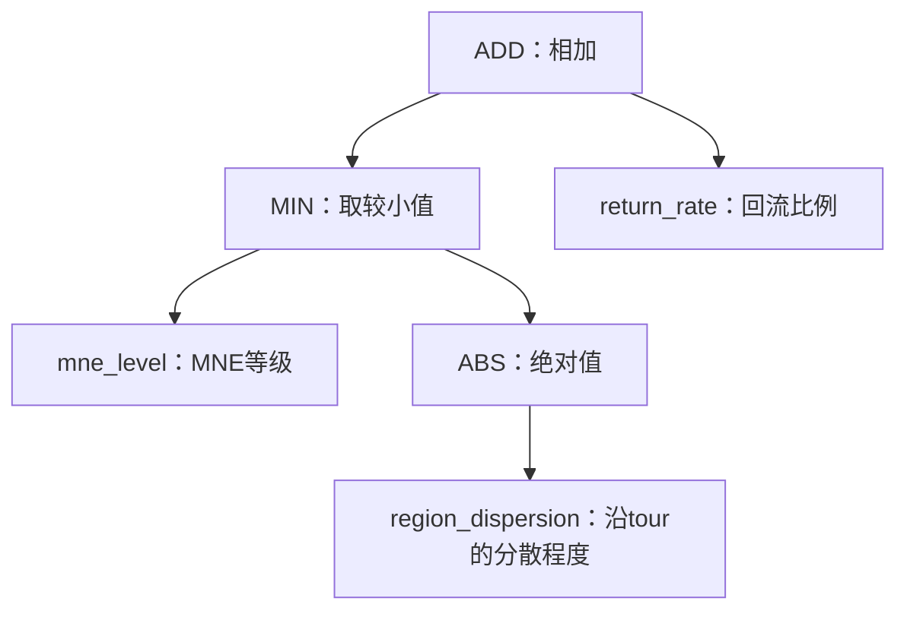

# TSP500：训练速度与训练信号

分析时间：2026-09-10 00:40 NZST。当前实验采用第 10 个完整评价代的固定快照；历史 RMTGP 对照采用已经完成的 TSP500 full-2opt LS-aware v2。本文只分析已有结果，没有重新运行 GPU，也没有修改正在运行的训练。精简数据见[第 10 代统计](../../results/v2/tsp500_training_signal_g10.json)。

**目前不能说我们的训练整体比 RMTGP 更快。控制器状态每轮更新，但 GP 的选择评分只使用终局结果；第 10 代还出现了大量重复表达式与同分个体，当前有效选择信息有限。**

**1. 实际耗时怎么比较**

| 训练 | 前期每代 | 中期每代 | 后期每代 | 已完成 50 代的累计时间 |
|---|---:|---:|---:|---:|
| 当前 FACO-GP，三个 seed | 第 6–10 代均值分别为 8.71、9.48、9.40 分钟 | 尚无结果 | 尚无结果 | 尚未完成 |
| RMTGP-AS | 117.1 秒 | 454.1 秒 | 2837.3 秒 | 14.83 小时 |
| RMTGP-ACS | 24.9 秒 | 80.6 秒 | 569.5 秒 | 2.92 小时 |
| RMTGP-MMAS | 35.7 秒 | 100.2 秒 | 460.9 秒 | 2.63 小时 |

RMTGP 三列分别对应第 1–15、16–35、36–50 代，数值先在每个 run 内平均，再平均三个 GP seed。累计时间取各 run 的 `cumulative_wall_time`，不是三个 seed 顺序执行的总时间。当前训练的每代时间排除开发监控；RMTGP 的历史计时口径及基线计算也与我们不同，不能据此宣布内核加速倍数。

历史记录来自 MTGP_ACO 的 `runs/tsp500-2opt-ls-v2/formal/train/{as,acs,mmas}/seed-{81001,81002,81003}/training_metrics.json`。九次运行的 `environment.json` 均记录 RTX PRO 5000 Blackwell，配置使用 `fp32_fast`；我们使用 RTX A5000、FP64 exact 搜索。相应协议见 [RMTGP TSP500 配置](../../../../MTGP_ACO/experiments/tsp500_2opt_ls_v2/config.yaml)与[本轮 FACO-GP 协议](../experiments/round_three_seed_v2.md)。

计算预算也不同：

| 项目 | 当前 FACO-GP | RMTGP TSP500 LS-aware v2 |
|---|---|---|
| 种群、代数 | 128 × 50 | 100 × 50 |
| 每次 ACO 的蚂蚁数 | 128，按 FACO 2022 | 32 |
| 初筛 | 全部个体直接完整评价 | 全种群用较短预算，32 个入围者追加高预算 |
| 第 1–15 代 | 16 实例 × 1 seed × 1000 轮 | 初筛 16 × 1 × 50；高预算 32 × 1 × 100 |
| 第 16–35 代 | 同上 | 初筛 32 × 1 × 100；高预算 64 × 2 × 200 |
| 第 36–50 代 | 同上 | 初筛 64 × 1 × 200；高预算 128 × 3 × 500 |
| 相同表达式 | 每个副本均完成本代评价 | 相同结构复用评价 |

我们每代固定 262,144,000 次完整路线评价。RMTGP 前期按 100 个初筛个体和 32 个入围者、不考虑结构复用计算，为 5,836,800 次，不含基线和监控；我们的预算约为这个数量的 44.9 倍。路线评价次数也不能完整代表局部搜索工作量。

所以，当前每代明显慢于 RMTGP 的前期；与其后期相比，接近 ACS、慢于 MMAS、快于 AS。但硬件、精度、算法、预算均不同，还没有同卡同工作量的对照。之前测得的 1.84 倍，是我们自己的旧实现与优化实现，在同一 A5000、同一初始种群和 H=1000 下的比较，不能解释为比 RMTGP 快 1.84 倍。

**2. 哪一层的训练信号密集**

在线控制层每一轮 ACO 都产生新的反馈：停滞轮数、返回原参考路线的比例、局部搜索工作量等。GP 用这些状态和动作特征给 32 个候选动作评分，再选择一个动作。本轮的 128 只蚂蚁共享该 colony 的动作，并非每只蚂蚁各更新一次 GP。

离线进化层采用终局评分。每个个体跑完 16 个实例，每个实例 1 个 ACO seed、1000 轮；外部 evaluator 只取最终最优路线的参考 gap，然后平均成一个 fitness：

`fitness = 16 个实例的最终 gap 的平均值`。

这意味着一次个体评价包含 16,000 次在线动作决策和 2,048,000 次路线评价，但最终只得到一个用于 GP 选择的标量。128 个个体全部评分后才进行代际选择、交叉与变异。中途较早找到好解、反复产生较好候选、某次动作带来的收益，目前都不直接进入 fitness。已有 `return_rate` 等反馈是下一轮 GP 的输入，不是额外的进化奖励。实现见 [fitness.py](../../python/gp_faco/fitness.py)、[training.py](../../python/gp_faco/training.py)和[控制状态更新](../../cuda/control_state.cuh)。

RMTGP 新版保留了更多过程信息：初筛采用每轮局部搜索后最好 7 只蚂蚁平均成本的跨轮均值；高预算采用 0.5 × 最终 gap 差值 + 0.5 × anytime gap 差值。anytime 指每轮截至当时最优解质量的平均值。这些统计在 GPU 上累计，只返回标量。它仍然是 GP 的整段求解评分，并没有每轮梯度更新。来源为 [RMTGP 输出统计定义](../../../../MTGP_ACO/src/rmtgp_aco/model.py)与[评分实现](../../../../MTGP_ACO/src/rmtgp_aco/training.py)。

**3. 第 10 代实际能区分多少个体**

下表对保存的 IR 数组排序后直接比较，相同表达式不包含普通程序编号；未计算内容哈希。fitness 按保存的完整数值比较，没有通过小数舍入制造同分。

| GP seed | 种群 | 不同表达式 | 不同终局 fitness | 最大同分组的个体数 |
|---|---:|---:|---:|---:|
| 1103 | 128 | 27 | 12 | 101 |
| 2207 | 128 | 32 | 18 | 100 |
| 3313 | 128 | 29 | 13 | 103 |

三个最大同分组的平均 gap 都为 0.21081288931324438%。同一表达式在同一面板的不同副本均得到相同 fitness。这是重复评价提供相同信息的直接证据。

主要重复表达式为：seed 1103 有 99 棵 `ABS(mne_level)`；seed 2207 有 91 棵 `ABS(mne_level)`、7 棵 `mne_level`；seed 3313 有 79 棵 `mne_level`、13 棵 `ABS(mne_level)`、7 棵 `ADD(mne_level,mne_level)`。当前 `mne_level` 取 0.25、0.5、0.75、1，对应 MNE 2、4、8、16，因此这些表达式都偏好 MNE=16。按当前合法动作集合和同分选择规则，它们选择相同动作，没有使用停滞、回流或 LS 工作反馈。这一判断来自表达式和动作实现的直接分析，不是对所有同分程序都已证明行为等价。

因此需要区分三件事：终局评分丢弃过程差别；种群中存在相同表达式的副本；不同表达式也可能选择同一动作。只增加 anytime，不能区分原本就产生完全相同行为的程序。当前结果还不足以估计独立重复求解的信噪比，也不能把所有同分都归因于局部搜索抹平差别。

**4. 后续优化应解决什么**

先处理确定的重复计算：同一代、相同实例和 seed、相同 IR 的副本可考虑共享一次评价，再将结果回填各副本。可以直接排序和比较指令数组，不需要哈希。第 10 代唯一表达式只有种群的 21%–25%，但这不保证墙钟时间按同一比例下降，GPU 占用和各程序的 LS 工作量还会影响收益。真实执行 FE、复用次数与逻辑种群评价次数也应分别记账，不能将省下的计算记为已执行 FE。

提高种群多样性、限制相同结构副本，可以让更多计算用于新候选；这会改变进化过程，应作为新的实验设置。行为多样性不能仅凭不同表达式或几个输入上的相同输出来断定，需要另外验证。

评分方面，可以在开发面板比较 final-only 与 final+anytime，必要时再研究 post-LS 候选质量统计。GPU 累积每轮最优成本无需传回整条轨迹，但额外成本和最终 H=5000 质量的关系仍需实测。固定同一面板时，仅减去共同 FACO baseline 的均值不会改变个体排名，也不会自动让信号变密集。增加 ACO seeds 主要降低估计噪声，同样不会增加时间上的反馈密度。

上述是依据第 10 代结果提出的后续改进方向，尚未加入当前正式运行。当前 50 代实验的最终训练、验证和测试结果仍未完成。

**5. GP Tree 输出什么，当前最好的是哪棵（第 12 代快照）**

本节更新于 2026-09-10，三个 seed 均已完成第 12 代，最近一次固定开发监控为第 10 代。表达式、原始评分与示意计算保存在[当前树的解释数据](../../results/v2/tsp500_tree_explanation_g12.json)。

一棵树计算一个候选动作的实数评分 `score = Tree(当前状态, 候选动作特征)`。同一棵树对最多 32 个动作分别计算，选择合法动作中分数最高者。输出分数越大，动作越优先；进化使用的外部 fitness 则是最终 gap，越小越好。动作分数没有概率或路线长度的含义，各算子输出裁剪到 [-8,8]。

每个动作包含三项决定：

| 动作分量 | 可选值 | 执行含义 |
|---|---|---|
| 重启模式 | 0 / 1 | 0 保持当前搜索；1 切换到档案中的替代参考路线并重置信息素与本 epoch 反馈，保留历史最优解 |
| 起始区域 | 0 / 1 / 2 / 3 | 分别为两个沿参考 tour 的连续片段、候选图局部邻域、分散节点集合；每组 16 个候选起点 |
| MNE | 2 / 4 / 8 / 16 | 构造时累计新连接的目标阈值，控制扰动程度；最终改变的边数不必恰好等于该值 |

动作编号为 `16 × 重启模式 + 4 × 区域编号 + MNE等级编号`，最后一项为 0、1、2、3。因此共有 `2 × 4 × 4 = 32` 个动作。缺少合法替代参考路线时，重启动作被屏蔽。同分（距最高分不超过 1e-6）选择编号最小者。例如动作 2 表示保持搜索、区域 0、MNE=8；动作 27 表示重启、区域 2、MNE=16。

每轮每个蚁群只选一次上述动作，128 只蚂蚁共享它，再各自从选中的 16 个候选起点抽样。区域只控制从哪里开始扰动，后续改动可以发生在其他位置。完整种群一次在线决策可理解为 `128 个体 × 16 实例 × 1 seed × 32 动作评分`，不是为每只蚂蚁训练一棵不同的树。

树可以使用的 12 个输入均位于 [0,1]：

| 输入 | 含义 |
|---|---|
| `progress` | 已用路线评价次数 / 总评价预算 |
| `stagnation` | 连续未改善轮数 / 32，最大为 1 |
| `return_rate` | LS 后回到当前参考路线的蚂蚁比例，经过指数平滑 |
| `ls_work` | 归一化 LS 工作量，经过指数平滑 |
| `restart` | 当前正在评分的候选动作是否要求重启 |
| `mne_level` | MNE 2、4、8、16 对应 0.25、0.5、0.75、1 |
| `ref_gap` | 候选参考路线相对当前在线最优路线的归一化差距；不读取最优标签 |
| `ref_diff` | 替代参考路线相对当前参考路线的采样结构差异；保持动作取 0 |
| `region_excess` | 区域中现有 tour 边相对局部距离尺度的长度超额 |
| `archive_disagreement` | 区域中 tour 边与历史档案路线的结构分歧 |
| `pheromone_strength` | 区域中 tour 边的归一化信息素强度 |
| `region_dispersion` | 区域节点在参考 tour 上的分散程度：其前驱/后继落在区域外的比例；不是坐标方差 |

前四项是该轮共同状态，后八项随候选动作或对应参考/区域变化。一项共同状态只有实际影响动作间相对评分时，才发挥自适应控制作用。

**固定开发监控中，目前最好的是 seed 3313 第 10 代的 `g010-i034`：**

```text
ADD(MIN(mne_level, ABS(region_dispersion)), return_rate)
```



它只有 6 个节点。由于分散程度非负，可读成 `score = min(MNE等级, 区域分散程度) + 回流比例`。固定监控为 16 个开发实例、1 个 ACO seed、1000 轮；各方法的平均 gap 为：

| 方法 | 固定开发监控平均 gap |
|---|---:|
| 这棵树（seed 3313，第 10 代） | 0.172605% |
| seed 1103 / 2207 的第 10 代冠军 | 0.201470% |
| 作者 FACO 连续适配 | 0.229228% |
| GPU FACO MNE8 对照 | 0.231529% |

这里只比较已经做过同一固定开发监控的候选，不能声称已选出最终最佳个体。该程序相对 GPU 对照降低 0.058924 个百分点的 gap；最终独立验证与测试尚未完成。

输出示例：假设同一候选区域的 `region_dispersion=0.625`，当前 `return_rate=0.20`。下表是手工输入在实际程序上的 CPU 示意计算，并非真实运行轨迹：

| MNE | 等级输入 | 输出评分（四舍五入） |
|---|---:|---:|
| 2 | 0.25 | 0.450 |
| 4 | 0.50 | 0.700 |
| 8 | 0.75 | 0.825 |
| 16 | 1.00 | 0.825 |

在这个区域内部，MNE=8 与 16 同分，编号更小的 MNE=8 优先。完整决策还会比较其他区域及合法的重启动作。该规则偏好分散程度较高的区域；一旦 MNE 等级达到分散程度对应的上限，继续增加 MNE 就不再增加评分。

`return_rate` 对该轮所有动作加上同一个数，所以这里它是共同偏移，不改变动作优先级。树中出现这个 terminal，不能作为“已经学会根据回流比例调整策略”的证据。

**最新第 12 代的训练面板上，三个冠军为：**

| GP seed | 冠军表达式 | 本代训练平均 gap |
|---|---|---:|
| 1103 | `mne_level` | 0.192326% |
| 2207 | `mne_level` | 0.192326% |
| 3313 | `ADD(ADD(0.0,mne_level),SUB(pheromone_strength,stagnation))` | 0.180612% |

第三棵树的程序编号为 `g012-i126`，可读成 `score = mne_level + pheromone_strength - stagnation`。它偏好较大 MNE 和信息素较强的区域；`stagnation` 在该轮也是各动作共同的偏移，不能直接解释为学到了停滞触发机制。这棵树尚未参加固定开发监控。第 12 代训练面板与第 10 代训练面板、固定开发面板不同，不能把这些分数混在一起排名。
